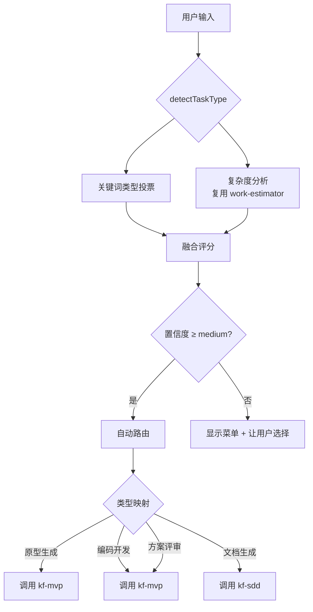

# kf-go — 统一工作流导航入口

> **自动检测任务类型 → 路由到最佳技能**

当用户输入任务描述但不确定走哪个通道时，kf-go 自动分析复杂度、检测类型，输出路由建议。

---

## 1. 自动检测流程



### 检测命令

```bash
node {IDE_ROOT}/helpers/skill-router.cjs detect-task --task "<用户输入>" [--verbose]
```

输出示例：
```json
{
  "taskType": "原型生成",
  "recommendedSkill": "kf-mvp",
  "confidence": "high",
  "signals": { "complexityMultiplier": 0.5, "pageCount": 2 }
}
```

---

## 2. 路由决策表

| taskType | 推荐技能 | 触发路径 | 说明 |
|----------|---------|---------|------|
| `原型生成` | **kf-mvp** | `Stage 0 → kf-mvp(P0)` | MVP/快速验证/原型 |
| `编码开发` | **kf-mvp** | `Stage 0 → kf-mvp(P0)` | MVP Pipeline 开发 |
| `文档生成` | **kf-sdd** | `Stage 0 → kf-sdd(P0)` | 详细设计/任务拆分 |
| `方案评审` | **kf-mvp** | `Stage 0 → kf-mvp(P0)` | MVP Pipeline 设计评审 |

### 置信度规则

| 置信度 | 票数阈值 | 行为 |
|--------|---------|------|
| **high** (≥6 票) | 类型信号强烈 | 自动路由，不询问 |
| **medium** (3-5 票) | 有明确倾向 | 输出建议 + 确认 |
| **low** (<3 票) | 信号弱 | 显示菜单让用户选择 |
| **unknown** | 空输入/无法解析 | 默认走 MVP |

---

## 3. 工作流

### 3.1 高置信度 → 自动路由

```
用户: "/go 我要做一个简单的 CRM 原型"
→ kf-go detect-task → taskType=原型生成 (high)
→ 自动跳转: invoke kf-mvp
  PRD 路径: {project_root}/{PRD 文件}
  输出路径: {project_root}/prototypes/
```

```
用户: "/go 实现用户认证系统，包含 JWT + 角色权限"
→ kf-go detect-task → taskType=编码开发 (high)
→ 自动跳转: invoke kf-mvp
  pipeline: Phase 0→7
  MVP 流水线: 设计+开发+原型
```

### 3.2 中置信度 → 建议 + 确认

```
用户: "/go 开发一个批发系统"
→ kf-go detect-task → taskType=编码开发 (medium)
→ 输出: "检测到编码开发任务（置信度: medium）
   建议路由: kf-mvp（MVP 快速原型开发）
   是/否？(或输入菜单编号)"
```

### 3.3 低置信度 → 菜单

```
用户: "/go"
→ kf-go detect-task → unknown
→ 输出:
   ====================
   WeCRM 工作流导航
   ====================
   1. ⚡ kf-mvp - MVP Pipeline（PRD+Spec+原型+开发）
   2. 📋 kf-sdd - 详细设计/任务拆分
   3. 🔍 kf-web-search - 技术搜索
   4. 🔍 kf-image-editor - 图片生成/编辑
   ...
   ====================
   输入编号或直接描述任务
```

---

## 4. 技术依赖

| 依赖 | 位置 | 用途 |
|------|------|------|
| `work-estimator.cjs` | `{IDE_ROOT}/helpers/work-estimator.cjs` | 任务复杂度分析（API数、表数、页面数） |
| `skill-router.cjs` | `{IDE_ROOT}/helpers/skill-router.cjs` | `detectTaskType()` 入口 |

---

## 5. 触发词

- `/go` — 统一入口
- `/导航` — 导航菜单
- `/开始` — 快速开始
- `/route` — 自动路由
- 描述性任务（无明确技能名时自动触发 kf-go 进行检测）

## 6. 注意事项

1. **轻量设计** — kf-go 本身不执行任何开发/原型/文档生成任务，只做路由决策
2. **复用现有分析** — 复杂度分析逻辑完全复用 work-estimator.cjs 的 `analyzeTask()`，不重复实现
3. **缓存友好** — 单次 `detect-task` 调用 < 10ms，不影响 KV Cache
4. **降级安全** — 无 work-estimator.cjs 时使用内建简化版 KEYWORD_RULES 降级运行
