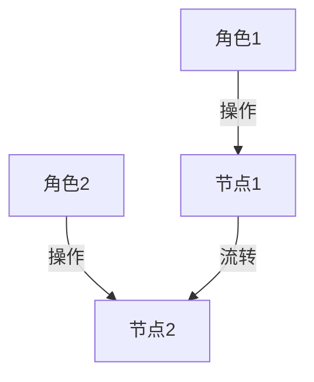
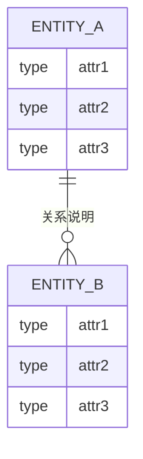
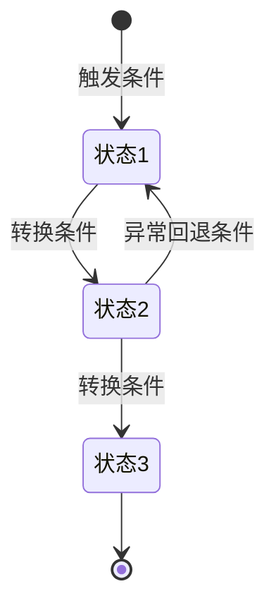
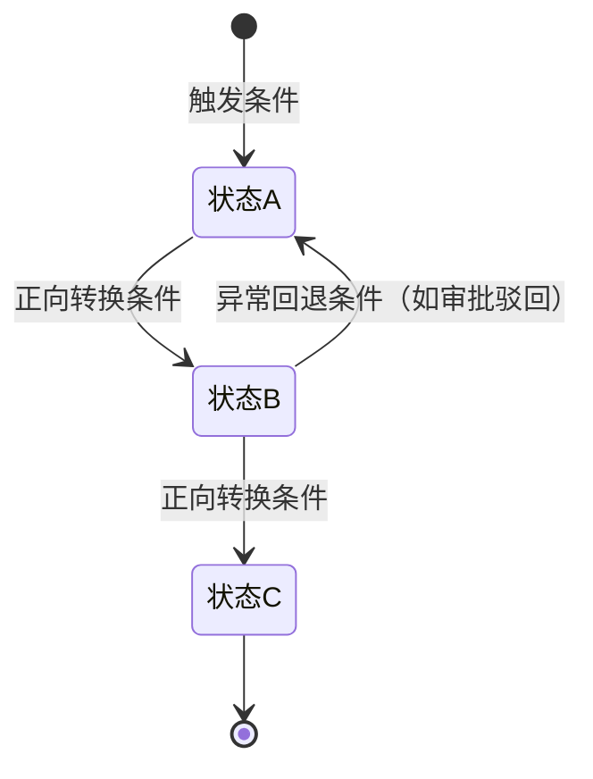
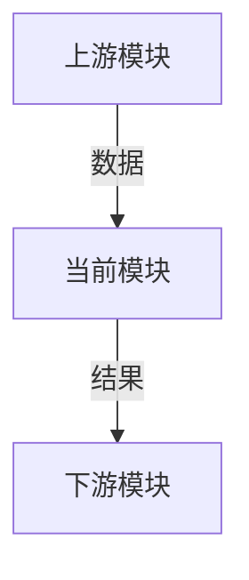
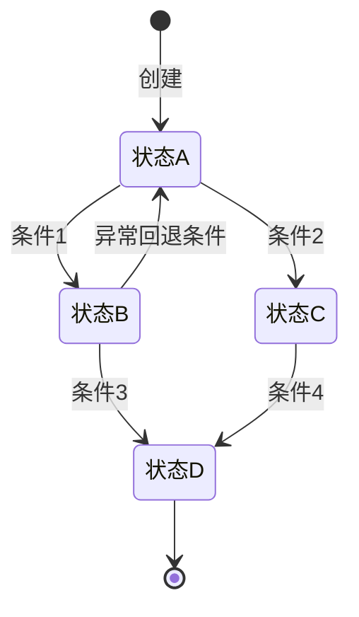

# PRD_TITLE

## 文档信息

| 字段 | 值 |
|------|-----|
| 版本 | v0.1 |
| 作者 | AUTHOR_NAME |
| 创建日期 | YYYY-MM-DD |
| 最后更新 | YYYY-MM-DD |
| 状态 | 草稿 / 评审中 / 已确认 |
| 产品类型 | B2C / B2B / 内部工具 / 平台型 |

---

## 1. 项目背景 🔴（人重点关注：业务决策与目标确认）

### 1.1 业务目标

- **核心问题**：PROBLEM_DESCRIPTION — 回答"为什么做"
- **目标用户**：TARGET_USERS
- **核心价值**：EXPECTED_VALUE
- **量化指标**：MEASURABLE_GOAL（至少一个数字型成功指标）

### 1.2 目标用户角色

| 角色 | 描述 | 核心诉求 |
|------|------|---------|
| ROLE_NAME | _角色定义_ | _该角色最关注什么_ |

---

## 2. 术语定义 🟢（人/AI共同：术语一致性检查）

> **铁律**：本章定义的术语，全文 MUST 统一使用。禁止混用同义词（如"用户"和"会员"混用）。

| 术语 | 英文 | 定义 | 备注 |
|------|------|------|------|
| TERM_CN | TERM_EN | _精确定义_ | _补充说明_ |

---

## 3. 风险与约束 🔴🟡（风险→人确认，技术约束→AI参考）

### 3.1 业务风险 🔴（人重点关注：风险判断）

_至少 3 条业务层面风险_

| 编号 | 风险描述 | 影响范围 | 缓解措施 |
|------|---------|---------|---------|
| R-001 | _风险描述_ | _影响哪些模块/流程_ | _如何缓解_ |

### 3.2 技术约束 🟡（AI实现参考：版本与框架约束）

| 维度 | 约束 | 版本号 |
|------|------|--------|
| 后端框架 | BACKEND_FRAMEWORK | VERSION |
| 前端框架 | FRONTEND_FRAMEWORK | VERSION |
| UI 组件库 | UI_LIBRARY | VERSION |
| 数据库 | DATABASE | VERSION |
| 构建工具 | BUILD_TOOL | VERSION |

### 3.3 Out of Scope 🔴（人重点关注：范围边界确认）

_逐条列出明确不做的事项_

| 编号 | 事项 | 原因 | 后续计划 |
|------|------|------|---------|
| OS-001 | _不做的事项_ | _为什么不做_ | _是否排入后续版本_ |

### 3.4 合规约束（条件章节）

_仅当项目涉及监管合规（如 GDPR、等保、行业准入）时输出_

| 编号 | 合规维度 | 约束要求 | 对应模块 | 技术实现要点 |
|------|---------|---------|---------|------------|
| C-001 | _合规维度_ | _约束要求_ | _模块_ | _技术要点_ |

---

## 4. 业务主流程 🟢（人/AI共同：流程确认与AI细化）

> **铁律**：每条业务线 MUST 独立成节。禁止将多条业务线混在一起写成一个大流程。

### 4.1 业务线A：LINE_A_NAME

- **流程编号**：FLOW-01
- **涉及角色**：ROLE_1, ROLE_2

| 阶段 | 角色 | 操作 | 产生的业务数据 |
|------|------|------|--------------|
| 1. 阶段名 | _角色_ | _操作描述_ | _数据产物_ |

_若涉及多角色协作，输出跨角色泳道图：_



### 4.2 业务线B：LINE_B_NAME

_按相同格式输出..._

---

## 5. ER 关系 🟢（人/AI共同：实体关系确认）

### 5.1 核心实体

| 实体名 | 含义 | 主要属性 |
|--------|------|---------|
| ENTITY_NAME | _实体含义_ | attr1, attr2, attr3, attr4, attr5 |

### 5.2 ER 图



### 5.3 关系说明

| 实体A | 关系 | 实体B | 业务约束 |
|--------|------|--------|----------|
| ENTITY_A | 1:N | ENTITY_B | _业务约束说明_ |

---

## 6. 功能需求 🟢（人/AI共同）

> **本章是 PRD 的灵魂。每个功能点 = 一个完整规格块，MUST 包含全部 8 个维度（5个原有维度 + 3个新增维度：字段规格、数据校验规则、数据权限）。**
> **AI 防偷懒**：生成每个功能块后，MUST 运行完整性自检表（见 SKILL.md Phase 1 Step 6）。

### 6.0 功能清单

按**客户端 → 一级模块 → 二级功能 → 三级功能 → 页面/按钮**的层级关系，输出完整的功能结构清单。此清单作为功能需求的目录索引，MUST 覆盖所有后续 6.1~6.N 中详细描述的功能点。

| 客户端 | 一级模块 | 二级功能 | 三级功能 | 对应页面 | 对应按钮/操作 |
|--------|---------|---------|---------|---------|-------------|
| Web端 | MODULE_A | SUB_A_1 | FUNC_A_1a | PAGE_A | BUTTON_A |
| Web端 | MODULE_A | SUB_A_1 | FUNC_A_1b | PAGE_A | BUTTON_B |
| 移动端 | MODULE_B | SUB_B_1 | FUNC_B_1a | PAGE_B | BUTTON_C |

### 6.1 模块A：MODULE_A_NAME

#### 页面：PAGE_A_NAME

##### F-001 功能名称 `P0`

**描述**（≥30字符）：
_详细描述该功能做什么、为什么需要、以及与其他功能的关联。禁止"管理XX"等泛化短语。_

**验收标准**（Gherkin Given-When-Then）：
```gherkin
Scenario: AC-001 - 场景描述
  Given 前置条件
  When 用户操作
  Then 系统响应 (Frontend)
  And 后端处理结果 (Backend)
```

**业务规则**（IF-THEN 格式，P0 ≥2条，P1 ≥1条）：
| 规则编号 | 规则描述 (IF-THEN) | 违反时处理 | 前置条件 |
|---------|-------------------|----------|---------|
| BR-001 | IF 条件 THEN 结果 | _处理方式_ | _前置条件_ |

**交互模式**（≥2步，用户操作→系统响应）：
| 步骤 | 用户操作 | 系统响应 | 备注 |
|------|---------|---------|------|
| 1 | _用户做了什么_ | _系统如何反馈_ | _补充说明_ |

**状态流转**（涉及状态 MUST 输出，否则写"不适用 — 无状态流转"）：
- **状态列表**：状态1, 状态2, 状态3
- **流转图**：

- **状态-操作-权限映射**：
| 状态 | 可执行操作 | 操作人 | 触发条件 | 下一状态 |
|------|----------|--------|---------|---------|
| 状态1 | _操作列表_ | _角色_ | _条件_ | _下一状态_ |

**维度6 — 字段规格**（当功能涉及页面时强制输出。按页面类型输出对应规格表）：
- 先通过 **Step 6.5 页面类型归类**确定页面类型，再输出对应规格：

**列表型页面规格**：
查询字段表：| 字段名 | 字段类型 | 前端表现形式 | 数据校验规则 |
|--------|---------|-------------|-------------|
| _字段_ | _类型_ | _输入框/下拉/日期_ | _规则_ |
列表字段表：| 字段名 | 字段类型 | 字段说明 | 前端表现形式 | 备注 |
|--------|---------|---------|-------------|------|
| _字段_ | _类型_ | _说明_ | _文本/标签/链接_ | _备注_ |
操作按钮表：| 按钮名 | 显示条件 | 操作权限 | 所属功能点 |
|--------|---------|---------|-----------|
| _按钮_ | _条件（如仅已审核状态可见）_ | _角色_ | _F-XXX_ |

**表单型页面/弹窗规格**：
| 字段名 | 字段类型 | 输入类型 | 数据来源 | 必填 | 校验规则 | 条件显示规则 | 联动规则 | 新增态 | 编辑态 | 查看态 | 说明 |
|--------|---------|---------|---------|------|---------|------------|---------|-------|-------|-------|------|
| _字段_ | _类型_ | _用户输入/下拉单选/下拉多选/单选组/多选组/日期/文件上传/开关_ | _静态/API/计算_ | _是/否_ | _规则_ | _条件_ | _联动关系_ | _可编辑/隐藏_ | _可编辑/只读/隐藏_ | _显示/隐藏_ | _说明_ |

**统计型页面规格**：
| 统计字段名 | 计算逻辑 | 展示形式 | 筛选条件 | 联动图表 | 说明 |
|-----------|---------|---------|---------|---------|------|
| _字段_ | _SUM/COUNT/AVG/自定义公式_ | _数值/百分比/特殊格式_ | _筛选维度_ | _图表名称_ | _说明_ |

**特殊页面说明**：
| 页面名称 | 页面布局描述 | 交互方式 | 特殊说明 |
|---------|------------|---------|---------|
| _页面_ | _布局说明_ | _交互方式_ | _特殊说明_ |

**维度7 — 数据校验规则**（所有功能强制，至少2条）：
| 校验对象 | 校验类型 | 校验规则 | 错误提示 | 校验位置 |
|---------|---------|---------|---------|---------|
| _字段名_ | _格式校验/范围校验/存在校验/唯一校验/关联校验_ | _具体规则表达式_ | _用户看到的错误消息_ | _前端/后端/双端_ |

**维度8 — 数据权限**（条件维度：涉及多角色/行级隔离时强制输出，否则写"不适用 — 全系统共享"）：
| 数据范围 | 可见角色 | 可操作角色 | 权限粒度 | 说明 |
|---------|---------|----------|---------|------|
| _实体/字段_ | _可见角色列表_ | _增删改角色列表_ | _全表/行级/字段级_ | _补充说明_ |

##### F-002 功能名称 `P1`

_按相同格式输出..._

#### 页面：PAGE_B_NAME

_按相同格式输出..._

### 6.2 模块B：MODULE_B_NAME

_按相同格式输出..._

---

## 7. 复杂/核心业务专题 🟢（人/AI共同：复杂逻辑确认）

> **仅对复杂/核心模块输出**（Phase 0 Q5 指定的模块）。

### 7.1 专题：MODULE_NAME

#### 7.1.1 功能来源与渠道分析

_数据从哪来：用户录入 / 设备采集 / 第三方推送 / 系统计算_

| 数据项 | 来源渠道 | 说明 |
|--------|---------|------|
| DATA_ITEM | _渠道_ | _说明_ |

#### 7.1.2 使用角色及其职责

| 角色 | 职责描述 | 操作边界 |
|------|---------|---------|
| ROLE | _职责_ | _可做什么/不可做什么_ |

#### 7.1.3 完整操作流程

**阶段一：准备**
_角色 → 操作 → 系统响应_

**阶段二：执行**
_角色 → 操作 → 系统响应_

**阶段三：校验**
_角色 → 操作 → 系统响应_

**阶段四：后续**
_角色 → 操作 → 系统响应_

#### 7.1.4 状态流转说明

_完整状态机图（含异常回退路径）_



| 状态 | 可执行操作 | 操作人 | 触发条件 | 下一状态 |
|------|----------|--------|---------|---------|
| 状态A | _操作_ | _角色_ | _条件_ | _下一状态_ |

#### 7.1.5 数据关联关系

**上游关联**（数据输入来源）：
| 数据来源模块 | 关联字段 | 关联方式 | 说明 |
|------------|---------|---------|------|
| MODULE | FIELD | _方式_ | _说明_ |

**下游关联**（数据输出去向）：
| 数据去向模块 | 输出字段 | 触发条件 | 说明 |
|------------|---------|---------|------|
| MODULE | FIELD | _条件_ | _说明_ |

#### 7.1.6 数据流转关系总图



#### 7.1.7 页面字段汇总

**筛选条件**：
| 字段名称 | 字段类型 | 前端表现形式 | 必填 | 备注 |
|---------|---------|-------------|------|------|
| FIELD | TYPE | _控件_ | 是/否 | _说明_ |

**列表字段**：
| 字段名称 | 字段类型 | 前端表现形式 | 备注 |
|---------|---------|-------------|------|
| FIELD | TYPE | _控件_ | _说明_ |

**表单字段**：
| 字段名称 | 字段类型 | 前端表现形式 | 必填 | 新增态 | 编辑态 | 备注 |
|---------|---------|-------------|------|-------|-------|------|
| FIELD | TYPE | _控件_ | 是/否 | _行为_ | _行为_ | _说明_ |

#### 7.1.8 报表统计（如适用）

| 维度 | 说明 |
|------|------|
| DIMENSION | _统计说明_ |

#### 7.1.9 智能规则/默认匹配逻辑（如适用）

| 条件 | 匹配规则 | 说明 |
|------|---------|------|
| _条件_ | _规则_ | _说明_ |

---

## 8. 复杂/核心实体状态图 🟢（人/AI共同：状态机逻辑确认）

> **对涉及复杂状态的实体逐个输出**。

### 8.1 实体：ENTITY_NAME

- **状态列表**：状态A, 状态B, 状态C, 状态D



**状态-操作-权限映射**：
| 状态 | 可执行操作 | 操作人 | 触发条件 | 下一状态 |
|------|----------|--------|---------|---------|
| 状态A | _操作_ | _角色_ | _条件_ | _下一状态_ |

**状态变更副作用**：
- 进入"状态X"后 → 不可编辑、自动发送通知
- 进入"状态Y"后 → 触发下游流程

---

## 9. 验收标准（集成测试级别）🔴🟡（Happy/Exception Path→人确认；边界值→AI生成+测试参考）

> **与 Chapter 6 的单功能验收标准不同**，本章输出跨功能的端到端集成测试场景。

### 9.1 Happy Path

```gherkin
Scenario: INT-HP-001 - 业务线A端到端流程 (P0)
  Given 系统已完成配置
  And 用户「角色A」已登录
  When 用户执行完整业务流程
    → 步骤1：操作描述
    → 步骤2：操作描述
    → 步骤3：操作描述
  Then 步骤1结果符合预期 (Frontend)
  And 步骤2结果符合预期 (Frontend)
  And 步骤3结果符合预期 (Frontend)
  And 数据在各模块间正确传递 (Backend)
```

### 9.2 Exception Path

```gherkin
Scenario: INT-EP-001 - 权限不足 (P0)
  Given 用户「角色B」已登录
  And 该角色无XX操作权限
  When 用户尝试执行XX操作
  Then 操作按钮不可见/置灰 (Frontend)
  And 直接调用接口返回 403 (Backend)
  And 错误码为 "FORBIDDEN" (Backend)

Scenario: INT-EP-002 - 数据冲突 (P0)
  Given XX数据已被用户A锁定/编辑
  When 用户B尝试同时编辑同一数据
  Then 提示"数据已被他人编辑，请刷新后重试" (Frontend)
  And 保存操作被拒绝 (Backend)
  And 错误码为 "DATA_CONFLICT" (Backend)

Scenario: INT-EP-003 - 外部依赖失败 (P0)
  Given 系统依赖第三方服务XX
  And 第三方服务返回超时/错误
  When 用户触发依赖该服务的操作
  Then 提示"服务暂时不可用，请稍后重试" (Frontend)
  And 已处理数据不丢失，状态保持不变 (Backend)
  And 错误码为 "EXTERNAL_SERVICE_ERROR" (Backend)

Scenario: INT-EP-004 - 边界值 (P1)
  Given 用户输入边界值数据
  When 提交操作
  Then 前端校验拦截非法值 (Frontend)
  And 或后端返回参数校验错误 (Backend)
  And 错误码为 "VALIDATION_ERROR" (Backend)

Scenario: INT-EP-005 - 并发操作 (P1)
  Given 两个用户同时提交相同操作
  When 操作结果产生冲突
  Then 一个操作成功，另一个提示"操作冲突" (Frontend)
  And 数据一致性未被破坏 (Backend)
  And 错误码为 "CONCURRENT_CONFLICT" (Backend)
```

### 9.3 异常处理与边界值表 🔴（测试关注：完善边界值覆盖）

> 每张页面的异常场景与边界值定义。用于测试用例设计的参考依据。

| 编号 | 异常场景描述 | 边界值定义 | 预期处理方式 | 对应功能点 |
|------|------------|-----------|-------------|-----------|
| EB-001 | _用户输入超出最大长度_ | 最大输入长度：_N_ 字符 | _提示"输入内容超出限制，最长NNN个字符" (Frontend)_ | _F-XXX_ |
| EB-002 | _数值超出范围_ | 最小值：_MIN_，最大值：_MAX_ | _提示"数值范围应为MIN~MAX" (Frontend)_ | _F-XXX_ |
| EB-003 | _输入特殊字符_ | 特殊字符：_@#$%^&*()_ 等 | _拦截或过滤，提示"不支持特殊字符" (Frontend)_ | _F-XXX_ |
| EB-004 | _必填字段为空_ | 空值 | _提示"该字段为必填项" (Frontend)_ | _F-XXX_ |
| EB-005 | _枚举值越界_ | 枚举范围：_枚举列表_ | _提示"请选择有效选项" (Frontend)_ | _F-XXX_ |
| EB-006 | _权限不足_ | 角色无操作权限 | _按钮置灰/隐藏，接口返回403 (Frontend+Backend)_ | _F-XXX_ |
| EB-007 | _数据并发冲突_ | 两用户同时编辑同一数据 | _后保存者提示"数据已被他人修改" (Frontend+Backend)_ | _F-XXX_ |

**覆盖门禁**：
- 每张页面 ≥ 5 条异常处理记录
- 边界值定义 MUST 覆盖：最大输入长度、数值范围（上界/下界）、特殊字符、空值、枚举越界
- 异常场景 MUST 覆盖：权限不足、数据冲突、外部依赖失败、格式非法、并发操作
- 加载 `assets/exception-boundary-rules.md` 获取完整规则