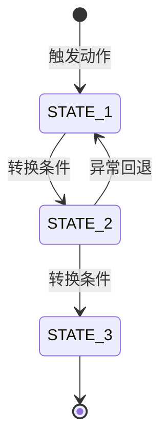

# PRD_TITLE

## 文档信息

| 字段 | 值 |
|------|-----|
| 版本 | v0.1 |
| 作者 | AUTHOR_NAME |
| 创建日期 | YYYY-MM-DD |
| 最后更新 | YYYY-MM-DD |
| 状态 | 草稿 / 评审中 / 已确认 |
| 所属模块 | MODULE_NAME |

---

## 1. 需求背景

### 1.1 业务目标

<!-- 描述本需求要解决的业务问题，以及期望达到的可量化效果 -->

- **核心问题**：PROBLEM_DESCRIPTION
- **目标用户**：TARGET_USERS
- **核心价值**：EXPECTED_VALUE
- **量化指标**：MEASURABLE_GOAL

### 1.2 目标用户角色

| 角色 | 描述 | 核心诉求 |
|------|------|---------|
| ROLE_NAME | _角色定义_ | _该角色最关注什么_ |

### 1.3 业务流程概览

<!-- 按「阶段」分组，描述每阶段的关键操作和产生的业务数据 -->

| 序号 | 阶段 | 角色 | 操作端 | 关键操作 | 产生的业务数据 |
|------|------|------|--------|---------|--------------|
| 1 | _阶段名称_ | _角色_ | _端_ | _操作描述_ | _数据产物_ |

---

## 2. 业务规则

<!-- 按模块编号列出所有业务规则，便于后续任务引用 -->

| 规则编号 | 所属模块 | 规则描述 | 优先级 | 备注 |
|---------|---------|---------|--------|------|
| R001 | MODULE | _具体规则描述_ | P0 | |
| R002 | MODULE | _具体规则描述_ | P1 | |

---

## 3. 数据字段定义

<!-- 每个字段必须表格化，禁止纯文字描述 -->

### 3.1 MODULE_ENTITY_NAME

| 字段名 | 字段类型 | 是否必填 | 校验规则 | 默认值 | 备注 |
|--------|---------|---------|---------|--------|------|
| FIELD_NAME | String/Int/... | 是/否 | _长度、格式、范围_ | — | |

---

## 4. 功能需求

<!-- 每个一级模块对应一个表格，格式：功能项 | 优先级 | 描述 | 验收标准 -->

### 4.1 MODULE_NAME

| 功能项 | 优先级 | 描述 | 验收标准 |
|--------|--------|------|---------|
| FEATURE_NAME | P0/P1/P2 | _功能简要描述_ | _具体可验证的验收标准_ |

---

## 5. 页面交互逻辑

<!-- 按页面维度描述，使用"用户操作 → 系统响应"格式，覆盖所有页面 -->

### 5.1 PAGE_NAME

**页面类型**：列表页 / 详情页 / 表单页

| 步骤 | 用户操作 | 系统响应 | 备注 |
|------|---------|---------|------|
| 1 | _用户做了什么_ | _系统如何反馈_ | |

**状态处理**：
- **加载中**：LOADING_BEHAVIOR
- **空状态**：EMPTY_STATE_BEHAVIOR
- **错误状态**：ERROR_STATE_BEHAVIOR

<!-- 核心流程（支付、审批、下单、赋码、打包等）强制输出 Mermaid 状态图，非核心流程可选 -->



**状态-权限映射**：

| 状态 | 可转移状态 | 触发条件 | 权限要求 | 前端展示 |
|------|---------|---------|--------|--------|
| STATE_1 | STATE_2 | _用户操作/系统事件_ | _角色要求_ | _按钮/状态标签_ |

---

## 6. 异常处理方案

<!-- 至少列举 5 种异常场景 -->

| 编号 | 异常场景 | 触发条件 | 处理方案 | 用户提示 |
|------|---------|---------|---------|---------|
| E001 | 网络异常 | _触发条件_ | _系统如何处理_ | _用户看到什么_ |
| E002 | 权限不足 | _触发条件_ | _系统如何处理_ | _用户看到什么_ |
| E003 | 数据冲突 | _触发条件_ | _系统如何处理_ | _用户看到什么_ |
| E004 | 并发操作 | _触发条件_ | _系统如何处理_ | _用户看到什么_ |
| E005 | 数据不存在 | _触发条件_ | _系统如何处理_ | _用户看到什么_ |

---

## 7. 验收标准

<!-- 使用标准 Gherkin Scenario 格式，每个 Then/And 标注 (Frontend) 或 (Backend) 执行边界 -->
<!-- 每个模块至少 3 个 Happy Path + 至少 2 个 Exception Path -->

### Happy Path

```gherkin
Scenario: AC001 - FEATURE_DESCRIPTION (P0)
  Given PRECONDITION
  And ADDITIONAL_PRECONDITION
  When USER_ACTION
  Then EXPECTED_FRONTEND_RESULT (Frontend)
  And EXPECTED_BACKEND_RESULT (Backend)

Scenario: AC002 - FEATURE_DESCRIPTION (P1)
  Given PRECONDITION
  When USER_ACTION
  Then EXPECTED_RESULT (Frontend)

Scenario: AC003 - BOUNDARY_DESCRIPTION (P1)
  Given PRECONDITION
  And BOUNDARY_CONDITION
  When USER_ACTION
  Then EXPECTED_RESULT (Frontend)
```

### Exception Path

```gherkin
Scenario: AC004 - EXCEPTION_DESCRIPTION (P0)
  Given PRECONDITION
  And EXCEPTION_CONDITION
  When EXCEPTION_TRIGGER
  Then ERROR_DISPLAY_MESSAGE (Frontend)
  And ERROR_RESPONSE_CODE "ERROR_CODE" (Backend)

Scenario: AC005 - ANOTHER_EXCEPTION_DESCRIPTION (P1)
  Given PRECONDITION
  And ANOTHER_EXCEPTION_CONDITION
  When EXCEPTION_TRIGGER
  Then ERROR_DISPLAY_MESSAGE (Frontend)
  And ERROR_RESPONSE_CODE "ERROR_CODE" (Backend)
```

---

## 8. UI 规范约束

> 仅记录设计决策级信息。具体 CSS 数值（间距、字体大小、圆角等）由 UI 原型生成技能从项目实际样式中提取。

| 维度 | 约束 |
|------|------|
| UI 组件库 | COMPONENT_LIBRARY（含版本号，如 Ant Design Vue 4.1.2） |
| 品牌主色 | COLOR_CODE |
| 响应式要求 | RESPONSIVE_REQUIREMENT |

---

## 9. 技术约束

| 维度 | 约束 |
|------|------|
| 后端技术栈 | BACKEND_STACK |
| 前端技术栈 | FRONTEND_STACK |
| 移动端技术栈 | MOBILE_STACK |
| 对接系统 | INTEGRATION_SYSTEMS |
| 参考规范 | REFERENCE_STANDARDS |

<!-- ER 图占位 -->
```
[此处插入数据模型 ER 图]
```

---

## 10. 功能结构矩阵

<!-- 展现完整的功能结构：1/2/3级菜单 → 界面 → 按钮 + 角色权限分配 -->

### 10.1 功能层次结构

| 一级模块 | 二级模块 | 三级功能 | 对应界面 | 界面中的操作按钮 |
|---------|---------|---------|---------|----------------|
| _一级菜单_ | _二级菜单_ | _具体功能_ | _页面/弹窗_ | _按钮列表_ |

### 10.2 角色-权限矩阵

| 角色 | 一级模块 | 二级模块 | 操作权限 | 数据范围 |
|------|---------|---------|---------|---------|
| _角色名称_ | _模块_ | _子模块_ | create/read/update/delete/approve | all/org/self |

---

## 11. 数据权限

> **适用场景**：多角色系统涉及数据隔离、分层查看权限时输出本章。

### 11.1 数据隔离模型

- **隔离级别**：行级 / 列级
- **组织层级**：上级组织是否可递归查看下级数据
- **跨组织共享规则**：

| 场景 | 规则 | 说明 |
|------|------|------|
| _场景描述_ | _权限规则_ | _详细说明_ |

### 11.2 操作范围

| 角色 | 查看范围 | 操作范围 | 审批范围 |
|------|---------|---------|---------|
| _角色_ | 全部/本组织/本人 | 增删改/仅查看 | 可审批/不可审批 |

### 11.3 特殊场景

- 管理员绕过数据隔离的规则
- 数据操作审计追踪要求
- 导入/导出权限控制

---

## 12. 资金流分析（条件章节）

> **适用场景**：电商、金融、政府补贴等涉及资金流转的项目。仅当需求中涉及资金流转时输出本章。

<!-- 按资金场景分组，每个节点标注处理主体和系统边界 -->

### 12.1 资金场景名称

| 序号 | 步骤节点 | 步骤描述 | 处理主体 | 资金方向 | 涉及金额/比例 | 外部系统/接口 |
|------|---------|---------|---------|---------|--------------|--------------|
| 1 | 节点名称 | 触发→处理→结果 | 本系统/第三方/人工 | 流入/流出/内部流转 | — | — |

---

## 13. 合规流程（条件章节）

> **适用场景**：政府项目、金融项目、涉及审计合规的项目。仅当需求中涉及合规约束时输出本章。

<!-- 按维度分组，输出四流合一矩阵 -->

### 13.1 维度名称

| 子项 | 核心要素 | 对应系统模块 | 数据来源/去向 | 合规要求 | 技术实现 | 备注 |
|------|---------|-------------|--------------|---------|---------|------|
| 子项名称 | — | — | — | — | — | — |

---

## 14. 待确认事项

<!-- 所有未决问题清单，在 PRD 确认前必须逐条解决 -->

| 编号 | 问题描述 | 提出人 | 提出日期 | 状态 | 结论 |
|------|---------|--------|---------|------|------|
| Q001 | _待确认的问题_ | AUTHOR | YYYY-MM-DD | 待讨论 / 已确认 | — |
