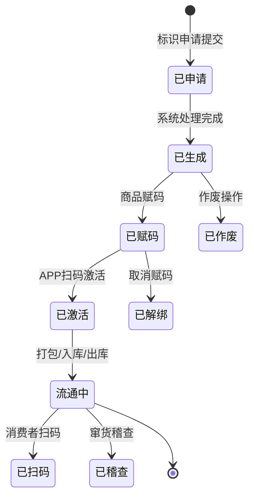

# 微点云平台 — 企业溯源管理系统 PRD

## 文档信息

| 字段 | 值 |
|------|-----|
| 版本 | v1.0 |
| 作者 | 逆向工程（系统抓取 + 产品使用文档 + 功能清单分析） |
| 创建日期 | 2026-05-18 |
| 最后更新 | 2026-05-18 |
| 状态 | 评审中 |
| 所属模块 | 企业溯源管理平台 |

---

## 1. 需求背景

### 1.1 业务目标

- **核心问题**：企业需要一套完整的商品全生命周期溯源管理系统，实现从生产、加工、仓储、物流到销售的全链路追溯，满足食品安全监管、药品防伪合规、农产品品牌建设等场景需求。
- **目标用户**：品牌商、生产制造企业、微点平台运营方、终端消费者
- **核心价值**：通过"一物一码"（微点码）实现商品溯源、防窜货、防伪稽查、扫码展示一体化管理
- **量化指标**：
  - 支撑多租户（企业ID隔离），码值全生命周期管理
  - 支持内部发码和外部发码两种码值供给模式
  - 微点云 Web 后台 + 微点溯源 APP + 消费者 H5 三端协同
  - 窜货预警、防伪核验、扫码统计等数据监控能力

### 1.2 目标用户角色

| 角色 | 描述 | 核心诉求 |
|------|------|---------|
| 微点平台运营人员 | 代企业进行运营管理、审批标识订单、管理 Ukey 和设备 | 批量处理企业请求，平台级数据监控 |
| 企业管理员 | 系统初始化配置、组织/岗位/角色/用户权限管理 | 快速搭建企业组织架构，分配操作权限 |
| 企业运营人员 | 商品建档、码值申请、溯源模板配置、标识绑定 | 高效管理商品信息和溯源码配置 |
| 仓库管理人员 | 打包关联、扫码出入库、库存盘点、转仓管理 | 准确完成实物与系统数据同步 |
| 消费者 | 扫码查看溯源信息 | 获取真实可靠的产品来源信息 |

### 1.3 业务流程概览

| 序号 | 阶段 | 角色 | 操作端 | 关键操作 | 产生的业务数据 |
|------|------|------|--------|---------|--------------|
| 1 | 系统初始化 | 企业管理员 | Web 后台 | 完善企业信息、创建组织/岗位/角色/用户 | 企业信息、用户体系 |
| 2 | 商品建档 | 企业运营人员 | Web 后台 | 新增品牌→新增商品→配置包装单位与规则 | 品牌、商品、包装规则 |
| 3 | 溯源配置 | 企业运营人员 | Web 后台 | 创建展示模板→创建溯源模板→配置溯源环节 | 展示模板、溯源模板 |
| 4 | 码值申请 | 企业运营人员 | Web 后台 | 内部发码/外部发码→申请标识→导出码值链接 | 标识订单、码值数据 |
| 5 | 商品赋码 | 企业运营人员 | Web 后台 | 将码值与商品关联绑定 | 商品-码值关联关系 |
| 6 | 溯源绑定 | 企业运营人员 | Web 后台 | 将溯源模板绑定至品牌/商品/码值 | 模板绑定关系 |
| 7 | 打包关联 | 仓库管理人员 | APP / Web | 按包装规则扫码建立多级包装关联 | 包装层级关系 |
| 8 | 出入库管理 | 仓库管理人员 | APP / Web | 扫码入库/出库/转仓 | 库存记录、出入库单据 |
| 9 | 发货配送 | 仓库管理人员 | Web 后台 | 新建销售发货单，关联经销商信息 | 发货单、经销商关联 |
| 10 | 流通稽查 | 企业运营人员 | APP | 扫码稽查窜货、防伪核验 | 稽查记录、窜货标记 |
| 11 | 消费者扫码 | 消费者 | H5 页面 | 扫描微点码查看溯源信息 | 扫码记录、预警触发 |

---

## 2. 业务规则

### 2.1 用户与权限

| 规则编号 | 所属模块 | 规则描述 | 优先级 | 备注 |
|---------|---------|---------|--------|------|
| R001 | 企业信息 | 企业需填写名称、法人、统一社会信用代码、地址等信息 | P0 | |
| R002 | 组织管理 | 组织用于映射企业部门结构，支持自定义编码和名称 | P0 | 可关联到用户 |
| R003 | 岗位管理 | 岗位独立于组织存在，支持自定义名称和编码 | P1 | 可关联到用户 |
| R004 | 角色管理 | 角色控制系统的菜单权限和数据权限 | P0 | 支持自定义角色名称 |
| R005 | 用户管理 | 用户必须关联组织、岗位、角色才能获得系统权限；手机号作为登录账号 | P0 | |

### 2.2 商品管理

| 规则编号 | 所属模块 | 规则描述 | 优先级 | 备注 |
|---------|---------|---------|--------|------|
| R010 | 品牌管理 | 品牌以卡片形式展示 Logo、名称、编码、启用状态 | P0 | 支持新增、查看、禁用 |
| R011 | 商品管理 | 商品必须关联品牌，必填字段含商品名称、单位、图片 | P0 | 支持批量导入 |
| R012 | 包装单位 | 包装码类型支持微点码，码值前缀建议首字母大写；支持自定义前缀 | P0 | 校验类型默认强校验 |
| R013 | 包装规则 | 需先创建包装单位，再为指定商品配置多级包装规则 | P1 | 如 1垛=10箱=100盒=1000个 |

### 2.3 溯源模板

| 规则编号 | 所属模块 | 规则描述 | 优先级 | 备注 |
|---------|---------|---------|--------|------|
| R020 | 展示模板 | 模板含品牌 Logo、轮播图、溯源信息、展示图等 | P0 | 扫码溯源必要步骤 |
| R021 | 溯源模板 | 基于展示模板配置，支持多个溯源环节和自定义字段 | P0 | 环节支持折叠 |
| R022 | 溯源环节 | 环节字段可选数据来源：本地上传/文本；当内容为图片时支持配置是否允许长按保存 | P0 | |
| R023 | 数据采集 | 可为单个码配置需采集的字段，通过溯源 APP 采集 | P1 | |

### 2.4 码值管理 — 内部发码

| 规则编号 | 所属模块 | 规则描述 | 优先级 | 备注 |
|---------|---------|---------|--------|------|
| R030 | 标识类型 | 支持微点码、微点防伪码、微点包装码、自定义码四种类型 | P0 | |
| R031 | 标识申请 | 支持纯数字编码或"首位两位大写字母+数字"规则 | P0 | |
| R032 | 标识概览 | 列表展示标识信息（申请数量、绑定情况），支持绑定外部字段 | P0 | |
| R033 | 码库管理 | 申请下载内部发码码包（.wdata 文件），用于绘制码图 | P0 | |
| R034 | 标识申请审批 | 审批通过的订单可撤销或禁用；禁用后无法下载相关文件 | P1 | |
| R035 | 码值导出 | 支持导出码值访问链接（明文/密文），可选择链接前缀和编码规则 | P0 | |

### 2.5 码值管理 — 外部发码

| 规则编号 | 所属模块 | 规则描述 | 优先级 | 备注 |
|---------|---------|---------|--------|------|
| R040 | 客户产品标识 | 用于区分同一企业下同一产品的不同制码参数需求 | P0 | |
| R041 | 订单管理 | 支持 Ukey 充值下单，选择 Ukey、输入充值数量 | P0 | 数据由运营平台加载 |
| R042 | 自由编码码库 | 提交实际用码订单，生成码包用于制图 | P0 | |
| R043 | 物料管理 | 维护物料信息，配合码库使用 | P1 | |
| R044 | 编码规则 | 外部发码编码规则维护 | P1 | |
| R045 | 订单列表 | 增加日期范围搜索，支持按钮导出 Excel 全字段 | P1 | |

### 2.6 商品赋码与溯源绑定

| 规则编号 | 所属模块 | 规则描述 | 优先级 | 备注 |
|---------|---------|---------|--------|------|
| R050 | 商品赋码（标识绑定） | 将标识与商品关联，支持起始值-终止值批量操作 | P0 | 扫码溯源的前置步骤 |
| R051 | 取消赋码 | 已打包状态的码不能取消赋码，需先解除打包关系 | P0 | |
| R052 | 溯源绑定 | 支持按品牌/商品/商品+包装/商品+批次/生产日期/码值绑定溯源模板 | P0 | 可选内链或外链 |
| R053 | 溯源解绑 | 支持按不同类型批量解绑（码段/批次号） | P1 | |
| R054 | 外部标识赋码 | 支持外部标识（非药监码）与商品关联 | P1 | 本期仅保留基本关联，药监码关联暂不纳入 |

### 2.7 外部标识赋码状态规则

| 规则编号 | 所属模块 | 规则描述 | 优先级 | 备注 |
|---------|---------|---------|--------|------|
| R055 | 状态字段 | 外部标识赋码列表增加状态字段：已赋码、已关联、已打包、已入库、已出库 | P1 | |
| R056 | 状态搜索 | 支持按状态搜索，码值按当前最终状态匹配 | P1 | 优先级：已赋码<已关联<已打包<已入库<已出库 |

### 2.8 生产与仓储

| 规则编号 | 所属模块 | 规则描述 | 优先级 | 备注 |
|---------|---------|---------|--------|------|
| R060 | 打包关联 | 支持多级包装（个→盒→箱→垛），扫码建立层级关系 | P0 | |
| R061 | 尾箱关联 | 可对非完整包装的商品进行提交打包 | P1 | |
| R062 | 追加打包 | 扫码追加商品完成非整箱变为整箱的打包关联 | P1 | |
| R063 | 解除打包 | 只能对未出库的码值解除打包关系；解除该码及下级码所有层级关系；若该码无上级码则无法解除 | P0 | |
| R064 | 打包统计 | 以"日期+商品名称+包装规则+批次号+操作人"为唯一主键展示 | P1 | 原名"关联列表" |
| R065 | 打包关系导出 | 导出后数据库标记每条包装的导出状态，已导出的下次不再导出 | P1 | |
| R066 | 打包关系导出记录 | 记录商品名称、包装规则、批次号、导出数量、导出时间、操作人 | P1 | 支持重新下载 |
| R067 | 入库管理 | 支持扫码入库和入库任务两种模式 | P0 | |
| R068 | 出库管理 | 销售出库必须关联销售发货单 | P0 | |
| R069 | 转仓 | 支持不同仓库/库区间的库存调拨 | P1 | |
| R070 | 仓库管理 | 支持多仓库/多库区，支持仓库人员配置 | P1 | |

### 2.9 渠道与经销商

| 规则编号 | 所属模块 | 规则描述 | 优先级 | 备注 |
|---------|---------|---------|--------|------|
| R080 | 经销商管理 | 经销商作为基础数据维护，不登录系统操作 | P0 | 发货时关联 |
| R081 | 经销商区域 | 经销商需配置销售区域（省市级别） | P0 | |
| R082 | 经销商仓库 | 经销商仓库数据维护（含出入库和库存） | P1 | 仅作数据记录 |

### 2.10 防窜货

| 规则编号 | 所属模块 | 规则描述 | 优先级 | 备注 |
|---------|---------|---------|--------|------|
| R090 | 窜货稽查 | APP 扫码稽查可标记窜货/未窜货 | P0 | |
| R091 | 窜货标记规则 | 包装码窜货时下级所有码自动标记相同窜货标记并计数 | P0 | |
| R092 | 窜货预警 | 以发货单为单位设置预警阈值，超出自动预警 | P1 | 支持邮箱通知 |
| R093 | 窜货记录 | 查看商品窜货历史记录 | P1 | |

### 2.11 防伪

| 规则编号 | 所属模块 | 规则描述 | 优先级 | 备注 |
|---------|---------|---------|--------|------|
| R100 | 数码核验 | 设置扫码预警次数，超限自动记录预警 | P0 | |
| R101 | 白名单 | 测试码段加入白名单不触发预警 | P1 | |
| R102 | 黑名单 | 风险码段加入黑名单，消费者扫码时收到风险提醒 | P1 | |
| R103 | 图像鉴伪 | 微点鉴伪模式扫描防伪码记录鉴伪结果 | P1 | |

### 2.12 码值生命周期

| 规则编号 | 所属模块 | 规则描述 | 优先级 | 备注 |
|---------|---------|---------|--------|------|
| R110 | 码值状态 | 申请→生成→赋码→激活→流通→核验/作废 | P0 | |
| R111 | 扫码激活 | 未激活的码值消费者扫码不可读 | P1 | |
| R112 | 码值作废 | 仅未被使用的码值可作废 | P1 | |
| R113 | 码值替换 | 新码值继承原码值的商品信息、批次、层级关系、出入库记录 | P1 | 替换后操作日志可追溯 |
| R114 | 高频扫码预警 | 短时间同一码被多次扫描时提示消费者 | P1 | |

### 2.13 标识关联清单

| 规则编号 | 所属模块 | 规则描述 | 优先级 | 备注 |
|---------|---------|---------|--------|------|
| R120 | 标识关联清单 | 列表字段：商品名称、码值（微外成对显示）、标识类型、包装单位、操作人、关联时间 | P1 | 新增子模块 |
| R121 | 关联清单搜索 | 筛选项：商品名称、码值、标识类型、包装单位、操作人、关联时间范围 | P1 | |

### 2.14 打印与质量检测

| 规则编号 | 所属模块 | 规则描述 | 优先级 | 备注 |
|---------|---------|---------|--------|------|
| R130 | 生产检测比对 | 标识关联外值时，扫码二维码对比结果是否一致 | P1 | |
| R131 | 工厂内部稽查 | 扫码核对系统关联的外部码值与实物是否一致 | P1 | |

---

## 3. 数据字段定义

### 3.1 企业信息

| 字段名 | 字段类型 | 是否必填 | 校验规则 | 默认值 | 备注 |
|--------|---------|---------|---------|--------|------|
| 企业ID | String | 自动生成 | — | — | 租户标识 |
| 企业名称 | String | 是 | — | — | |
| 企业法人 | String | 是 | — | — | |
| 统一社会信用代码 | String | 是 | 18位 | — | |
| 企业地址 | String | 是 | — | — | |
| 营业执照 | File | 是 | 图片格式 | — | |
| 企业授权书 | File | 是 | — | — | |

### 3.2 用户体系

| 字段名 | 字段类型 | 是否必填 | 校验规则 | 默认值 | 备注 |
|--------|---------|---------|---------|--------|------|
| 登录账号 | String | 是 | 手机号格式 | — | |
| 员工工号 | String | 否 | — | — | |
| 所属组织 | FK | 是 | — | — | |
| 所属岗位 | FK | 是 | — | — | |
| 所属角色 | FK | 是 | — | — | |
| 状态 | Enum | 是 | 启用/禁用 | 启用 | |

### 3.3 品牌

| 字段名 | 字段类型 | 是否必填 | 校验规则 | 默认值 | 备注 |
|--------|---------|---------|---------|--------|------|
| 品牌名称 | String | 是 | — | — | |
| 品牌Logo | File | 否 | 图片格式 | — | 以卡片形式展示 |
| 品牌编码 | String | 自动生成 | — | — | |
| 状态 | Enum | 是 | 启用/禁用 | 启用 | |

### 3.4 商品

| 字段名 | 字段类型 | 是否必填 | 校验规则 | 默认值 | 备注 |
|--------|---------|---------|---------|--------|------|
| 商品名称 | String | 是 | — | — | |
| 所属品牌 | FK | 是 | — | — | |
| 品类编码 | String | 否 | — | — | |
| 规格 | String | 否 | — | — | |
| 有效期 | Int | 否 | 天数 | — | |
| 子类编码 | String | 否 | — | — | |
| 商品编码 | String | 否 | — | — | |
| 商品条码 | String | 否 | EAN-13 | — | |
| 商品单位 | String | 是 | — | — | |
| 商品图片 | File | 是 | 图片格式 | — | |

### 3.5 包装单位

| 字段名 | 字段类型 | 是否必填 | 校验规则 | 默认值 | 备注 |
|--------|---------|---------|---------|--------|------|
| 包装单位名称 | String | 是 | — | — | 如箱、盒 |
| 包装码类型 | Enum | 是 | 微点码/自定义 | 微点码 | |
| 码值前缀 | String | 否 | 建议大写字母 | — | 单位间不可重复 |
| 状态 | Enum | 是 | 启用/禁用 | 启用 | |

### 3.6 展示模板

| 字段名 | 字段类型 | 是否必填 | 校验规则 | 默认值 | 备注 |
|--------|---------|---------|---------|--------|------|
| 模板名称 | String | 是 | — | — | |
| 初步鉴定 | Boolean | 否 | — | 否 | 防伪需求时启用 |
| 轮播图 | File[] | 否 | 图片 | — | |
| 品牌LOGO | File | 否 | 图片 | — | 支持使用企业LOGO |
| 品牌名称 | String | 否 | — | — | 支持使用企业名称 |
| 溯源信息 | Text | 是 | — | — | |
| 展示图 | File | 否 | 图片 | — | |
| 显示返回扫码 | Boolean | 否 | — | 否 | |
| 显示返回顶部 | Boolean | 否 | — | 否 | |

### 3.7 溯源模板

| 字段名 | 字段类型 | 是否必填 | 校验规则 | 默认值 | 备注 |
|--------|---------|---------|---------|--------|------|
| 模板名称 | String | 是 | — | — | |
| 展示样式 | FK | 是 | — | — | 关联展示模板 |
| 状态 | Enum | 是 | 启用/禁用 | 启用 | |

### 3.8 溯源环节

| 字段名 | 字段类型 | 是否必填 | 校验规则 | 默认值 | 备注 |
|--------|---------|---------|---------|--------|------|
| 环节名称 | String | 是 | — | — | 如"公司介绍" |
| 显示头部 | Boolean | 否 | — | 是 | |
| 允许折叠 | Boolean | 否 | — | 是 | |
| 数据来源 | Enum | 是 | 本地上传/文本 | — | |
| 字段名称 | String | 是 | — | — | |
| 文本内容 | Text | 条件必填 | — | — | 文本来源时必填 |
| 允许复制 | Boolean | 否 | — | 否 | |
| 允许长按保存 | Boolean | 否 | — | 否 | 内容为图片时可选配置 |

### 3.9 标识订单（内部发码）

| 字段名 | 字段类型 | 是否必填 | 校验规则 | 默认值 | 备注 |
|--------|---------|---------|---------|--------|------|
| 交付类型 | Enum | 是 | 对接产线/交付标签 | — | |
| 标识类型 | Enum | 是 | 微点码/防伪码/包装码/自定义 | — | |
| 标识长度 | Int | 是 | 8-20位 | — | |
| 关联文件 | File | 否 | — | — | |
| 关联数据校验 | — | 条件 | 行数必须与申请数量一致 | — | 不一致时提交失败 |
| 制作方 | String | 是 | — | — | |
| 产品系列 | String | 是 | — | — | |
| 签凭证 | File | 否 | — | — | |
| 收货地址 | String | 条件必填 | — | — | 交付标签时必填 |
| 邮箱 | String | 条件必填 | — | — | |
| 限定制码设备 | Boolean | 否 | — | 否 | |
| 可用额度 | Int | 否 | — | — | 关联费用账户 |

### 3.10 商品赋码（标识绑定）

| 字段名 | 字段类型 | 是否必填 | 校验规则 | 默认值 | 备注 |
|--------|---------|---------|---------|--------|------|
| 起始码值 | String | 是 | — | — | |
| 终止码值 | String | 是 | — | — | |
| 关联商品 | FK | 是 | — | — | |
| 生产日期 | Date | 否 | — | — | |
| 访问配置 | Enum | 是 | 内链/外链 | 内链 | 内链=溯源模板 |

### 3.11 溯源绑定

| 字段名 | 字段类型 | 是否必填 | 校验规则 | 默认值 | 备注 |
|--------|---------|---------|---------|--------|------|
| 绑定模板 | FK | 是 | — | — | 关联溯源模板 |
| 绑定类型 | Enum | 是 | 品牌/商品/商品+包装/商品+批次/生产日期/码值 | — | |
| 目标对象 | FK | 是 | — | — | 根据类型动态选择 |

### 3.12 经销商

| 字段名 | 字段类型 | 是否必填 | 校验规则 | 默认值 | 备注 |
|--------|---------|---------|---------|--------|------|
| 经销商编码 | String | 是 | — | — | |
| 经销商名称 | String | 是 | — | — | |
| 联系人 | String | 是 | — | — | |
| 联系电话 | String | 是 | 手机号格式 | — | |
| 地址 | String | 是 | — | — | |
| 窜货预警数量 | Int | 否 | — | — | |
| 下级数量 | Int | 否 | — | — | 全局规则配置 |
| 状态 | Enum | 是 | 启用/禁用 | 启用 | |

### 3.13 仓库

| 字段名 | 字段类型 | 是否必填 | 校验规则 | 默认值 | 备注 |
|--------|---------|---------|---------|--------|------|
| 仓库编码 | String | 是 | — | — | |
| 仓库名称 | String | 是 | — | — | |
| 详细地址 | String | 是 | — | — | |
| 状态 | Enum | 是 | 启用/禁用 | 启用 | |
| 仓库人员 | FK[] | 否 | — | — | |

### 3.14 销售发货单

| 字段名 | 字段类型 | 是否必填 | 校验规则 | 默认值 | 备注 |
|--------|---------|---------|---------|--------|------|
| 发货组织 | FK | 是 | — | — | |
| 收货方（经销商） | FK | 是 | — | — | |
| 入库仓库 | FK | 是 | — | — | |
| 商品明细 | JSON[] | 是 | — | — | 商品+数量 |

### 3.15 打包关系

| 字段名 | 字段类型 | 是否必填 | 校验规则 | 默认值 | 备注 |
|--------|---------|---------|---------|--------|------|
| 商品名称 | FK | 是 | — | — | |
| 包装规则 | JSON | 是 | — | — | 如 1:10:100 |
| 批次号 | String | 是 | — | — | |
| 生产日期 | Date | 是 | — | — | |
| 码值层级 | JSON[] | 是 | — | — | 个→盒→箱→垛 |

### 3.16 Ukey

| 字段名 | 字段类型 | 是否必填 | 校验规则 | 默认值 | 备注 |
|--------|---------|---------|---------|--------|------|
| Ukey ID | String | 自动 | — | — | 运营平台维护 |
| 外壳号 | String | 自动 | — | — | |
| 剩余可用次数 | Int | 自动 | — | — | |

---

## 4. 页面交互逻辑

### 4.1 微点云 Web 后台

#### 4.1.1 登录

**页面类型**：表单页

| 步骤 | 用户操作 | 系统响应 |
|------|---------|---------|
| 1 | 输入企业ID | — |
| 2 | 输入手机号/账号 | — |
| 3 | 输入密码 | — |
| 4 | 点击「登录」或回车 | 触发滑块验证 |
| 5 | 完成滑块验证 | 通过后校验密码 |
| 6 | 校验通过 | 跳转首页 |

**状态处理**：
- **加载中**：按钮显示 loading 状态
- **错误状态**：提示"企业ID/账号/密码错误"

#### 4.1.2 发码中心 — 标识申请

**页面类型**：表单页 + 列表页

| 步骤 | 用户操作 | 系统响应 |
|------|---------|---------|
| 1 | 点击「新增」 | 弹出标识申请表单 |
| 2 | 选择交付类型、标识类型、设置标识长度 | 动态展示关联字段 |
| 3 | 上传关联文件（可选） | 文件上传进度；如有关联数据则校验行数与申请数量是否一致 |
| 4 | 提交申请 | 创建标识订单，待审批/处理 |
| 5 | 列表查看历史订单 | 分页展示 |

**列表字段**：订单号、标识类型、长度、数量、状态、创建时间、操作

#### 4.1.3 发码中心 — 标识概览 / 码库管理

**页面类型**：列表页

| 步骤 | 用户操作 | 系统响应 |
|------|---------|---------|
| 1 | 查看标识订单列表 | 展示申请数量、绑定情况 |
| 2 | 点击「下载码包」 | 生成并下载 `.wdata` 文件 |
| 3 | 点击「绑定外部字段」 | 跳转外部字段关联 |

#### 4.1.4 发码中心 — 标识绑定（商品赋码）

**页面类型**：表单页

| 步骤 | 用户操作 | 系统响应 |
|------|---------|---------|
| 1 | 输入起始码值和终止码值 | 数量自动计算 |
| 2 | 选择关联商品 | 搜索商品列表 |
| 3 | 选择生产日期（可选） | — |
| 4 | 选择访问配置（内链/外链） | — |
| 5 | 点击确定 | 批量绑定 |

**码值状态流转**：



**状态-权限映射**：

| 状态 | 可转移状态 | 触发条件 | 权限要求 |
|------|---------|---------|--------|
| 已生成 | 已赋码 | 商品赋码操作 | 企业运营人员 |
| 已赋码 | 已激活 | APP 扫码激活 | 仓库/运营人员 |
| 已赋码 | 已解绑 | 取消赋码操作 | 企业运营人员 |
| 已激活/流通中 | 已稽查 | APP 窜货稽查 | 稽查人员 |
| 已生成 | 已作废 | 作废操作（未使用者） | 企业运营人员 |

#### 4.1.5 发码中心 — 外部发码

**页面类型**：列表页 + 表单页

| 步骤 | 用户操作 | 系统响应 |
|------|---------|---------|
| 1 | 查看订单列表 | 分页展示 |
| 2 | 点击「新增Ukey充值单」 | 选择Ukey、输入充值数量 |
| 3 | 填写回执邮箱、备注 | — |
| 4 | 提交 | 创建充值单 |
| 5 | 查看自由编码码库 | 申请下载码包 |

**列表筛选项**：日期范围、支持导出Excel全字段

#### 4.1.6 商品中心 — 品牌管理

**页面类型**：卡片展示页

| 步骤 | 用户操作 | 系统响应 |
|------|---------|---------|
| 1 | 查看品牌列表 | 卡片形式展示Logo、名称、编码、状态 |
| 2 | 点击「新增」 | 弹窗填写品牌名称、上传Logo |
| 3 | 搜索品牌 | 按名称/编码过滤 |
| 4 | 点击禁用/启用 | 切换品牌状态 |

#### 4.1.7 商品中心 — 商品管理

**页面类型**：列表页 + 表单弹窗

| 步骤 | 用户操作 | 系统响应 |
|------|---------|---------|
| 1 | 查看商品列表（名称、品牌、规格、单位、编码） | 分页 |
| 2 | 点击「新增」 | 弹出表单 |
| 3 | 填写品牌、名称、规格、有效期、单位、上传图片等 | — |
| 4 | 提交 | 校验必填字段 |
| 5 | 批量导入 | 下载模板→填数据→上传 |

#### 4.1.8 商品中心 — 包装单位

**页面类型**：列表页

| 步骤 | 用户操作 | 系统响应 |
|------|---------|---------|
| 1 | 查看包装单位列表（编码、名称、类型、数量、状态） | 分页 |
| 2 | 新增包装单位 | 输入名称、选择码类型、设置前缀 |
| 3 | 编辑/停用 | 状态变更 |

#### 4.1.9 溯源中心 — 展示模板

**页面类型**：表单页

| 步骤 | 用户操作 | 系统响应 |
|------|---------|---------|
| 1 | 点击「添加模板」 | 打开配置表单 |
| 2 | 输入模板名称 | — |
| 3 | 配置品牌Logo、轮播图、溯源信息等 | — |
| 4 | 提交 | 模板保存 |

#### 4.1.10 溯源中心 — 溯源模板管理

**页面类型**：多步骤表单

| 步骤 | 用户操作 | 系统响应 |
|------|---------|---------|
| 1 | 输入模板名称、选择展示样式 | 关联展示模板 |
| 2 | 配置溯源环节 | 添加环节名称 |
| 3 | 在每个环节下添加字段 | 选择数据来源（本地上传/文本） |
| 4 | 预览模板效果 | 模拟消费者端H5展示 |
| 5 | 提交 | 模板生效 |

#### 4.1.11 溯源中心 — 溯源绑定管理

**页面类型**：表单页 + 列表页

| 步骤 | 用户操作 | 系统响应 |
|------|---------|---------|
| 1 | 选择绑定模板 | 已有溯源模板列表 |
| 2 | 选择绑定类型 | 品牌/商品/商品+包装/批次/日期/码值 |
| 3 | 搜索选择目标对象 | — |
| 4 | 提交绑定 | 关联生效 |
| 5 | 预览模板效果 | — |

#### 4.1.12 生产中心 — 打包关系管理

**页面类型**：列表页 + 表单

| 步骤 | 用户操作 | 系统响应 |
|------|---------|---------|
| 1 | 查看打包关系列表 | 分页 |
| 2 | 点击「上传打包关系」 | 选择商品、填写包装规则、批次号 |
| 3 | 下载并填写关联表 | 模板文件 |
| 4 | 上传填好的关联表 | 批量导入 |
| 5 | 导出打包关系 | 标记已导出状态，同批不再重复导出 |

**筛选项**：批次号、入库仓库、是否最大包装（默认是）

#### 4.1.13 生产中心 — 仓库管理

**页面类型**：列表页 + 表单

| 步骤 | 用户操作 | 系统响应 |
|------|---------|---------|
| 1 | 查看仓库列表 | 分页 |
| 2 | 点击「新增工厂/仓库」 | 输入编码、名称、地址、状态 |
| 3 | 设置仓库人员 | 选择管理员、库管员 |
| 4 | 提交 | 仓库创建 |

#### 4.1.14 生产中心 — 入库/出库任务管理

**页面类型**：列表页

| 步骤 | 用户操作 | 系统响应 |
|------|---------|---------|
| 1 | 查看任务列表 | 分页展示 |
| 2 | 筛选任务（发货组织、仓库、时间范围） | — |
| 3 | 查看详情 | 完整的入库单/出库单信息 |

**出库任务列表**：增加「备注」字段（支持搜索）

#### 4.1.15 生产中心 — 销售发货单

**页面类型**：表单页

| 步骤 | 用户操作 | 系统响应 |
|------|---------|---------|
| 1 | 选择发货组织 | — |
| 2 | 选择收货方（经销商） | — |
| 3 | 选择入库仓库 | — |
| 4 | 添加发货商品 | 搜索→勾选→确认数量 |
| 5 | 提交 | 生成发货单，创建出库任务 |

**筛选项**：发货组织、收货组织

#### 4.1.16 生产中心 — 标识关联清单

**页面类型**：列表页（新增子模块）

| 步骤 | 用户操作 | 系统响应 |
|------|---------|---------|
| 1 | 查看关联清单 | 字段：商品名称、码值、标识类型、包装单位、操作人、关联时间 |
| 2 | 搜索筛选 | 按商品名称、码值、标识类型、操作人、关联时间范围搜索 |

#### 4.1.17 渠道中心 — 经销商管理

**页面类型**：列表页 + 表单

| 步骤 | 用户操作 | 系统响应 |
|------|---------|---------|
| 1 | 查看经销商列表 | 编码、名称、联系人、电话 |
| 2 | 新增经销商 | 填写编码、名称、联系人、电话、窜货预警数量等 |
| 3 | 添加下级经销商 | 树形层级 |

#### 4.1.18 渠道中心 — 区域管理

**页面类型**：表单页

| 步骤 | 用户操作 | 系统响应 |
|------|---------|---------|
| 1 | 新增区域 | 输入区域名称 |
| 2 | 勾选省市辖区 | 省市区级联选择 |
| 3 | 提交 | — |

#### 4.1.19 防窜中心

**页面类型**：列表页

| 功能 | 说明 |
|------|------|
| 窜货稽查 | 查看APP扫码稽查数据，支持撤销窜货标记 |
| 窜货预警 | 查看/设置预警阈值，预警信息发送至邮箱 |
| 窜货记录 | 查看商品窜货历史记录 |

#### 4.1.20 防伪中心

**页面类型**：列表页 + 表单

| 功能 | 说明 |
|------|------|
| 数码核验管理 | 查看/设置防伪码值信息，扫码预警次数配置 |
| 码值白名单 | 新增码段白名单，测试码段跳过预警 |
| 码值黑名单 | 新增码段黑名单，风险码值消费者扫码收到提醒 |
| 图像鉴伪管理 | 查看/管理微点防伪码的鉴伪结果 |

#### 4.1.21 数据中心

**页面类型**：报表视图

| 模块 | 数据内容 |
|------|---------|
| 扫码次数视图 | 平台累计扫码次数、标识数量占比、省份扫码排名、实时扫码记录 |
| 扫码记录 | 全量扫码信息，支持按码值精准查询 |
| 窜货视图 | 窜货/未窜货统计、经销商排名、窜货批次、预警记录 |
| 微点发码标识申请数量 | 各码制的已申请/已绑定/未绑定 |
| 商品数量 | 各品牌/商品库存分布 |
| 操作日志 | 员工操作变更追溯 |
| 登录记录 | APP及后台登录日志，支持设备管控 |
| Ukey使用 | 单Ukey的授权烧录明细 |
| 生产检测比对记录 | 微点码与二维码关联校验记录 |
| 工厂内部稽查记录 | 扫码核查系统关联与实物一致性记录 |

### 4.2 微点溯源 APP

#### 4.2.1 登录

**页面类型**：表单页

| 步骤 | 用户操作 | 系统响应 |
|------|---------|---------|
| 1 | 输入企业ID | — |
| 2 | 输入账号和密码 | — |
| 3 | 点击登录 | 校验成功后进入首页 |
| 4 | 登出/修改密码 | — |

#### 4.2.2 信息查询

| 功能 | 操作 | 说明 |
|------|------|------|
| 码值查询 | 扫码/录入码值 | 查询码值详细信息（溯源信息、出入库记录、关联商品） |
| 批次查询 | 录入批次号 | 查询对应商品信息和库存 |
| 窜货稽查 | 扫码→查看销售区域→标记 | 人工抽检判定是否窜货 |
| 微点鉴 | 扫码 | 查看溯源信息+鉴别码图真伪 |
| 关联比对 | 扫微点码+扫二维码 | 对比两者关联关系是否一致 |
| 工厂内部稽查 | 扫微点码+扫二维码 | 核对系统关联与实物一致性 |
| 关联查询 | 录入码值 | 查询码值关联的商品、状态、类型、包装明细 |

#### 4.2.3 码值管理

| 功能 | 操作 | 说明 |
|------|------|------|
| 商品赋码 | 选品牌商品→录入码值→绑定 | 扫码关联码值和商品 |
| 取消赋码 | 选品牌商品→录入码值→解绑 | 取消商品与码值关联 |
| 扫码激活 | 录入码值→确认激活 | 激活后消费者可读 |
| 扫码作废 | 录入码值→确认作废 | 仅未使用者可作废 |
| 码值替换 | 旧码值→新码值→替换 | 新码继承旧码所有信息 |
| 数据采集 | 选模板→录入信息→提交 | 为单码录入定制溯源信息 |

#### 4.2.4 关联管理（打包）

| 功能 | 操作 | 说明 |
|------|------|------|
| 打包关联 | 选商品→包装规则→批次→扫码 | 建立多级包装层级关系 |
| 扫码打包 | 同上 | — |
| 尾箱关联 | 选商品→包装规则→入库信息→扫码 | 非完整包装打包，支持打包即入库 |
| 追加打包 | 扫描已有包装→追加新码 | 非整箱补满 |
| 解除打包 | 扫描/录入码值→解除 | 解除该码及下级所有层级 |
| 打包统计 | 选商品/批次/操作人/时间→查询 | 以日期+商品+规则+批次+操作人为唯一主键 |

**打包关联界面**：显示已打包数量（如"已完成：XXX盒"，单位取当前层级最上级）

#### 4.2.5 入库/出库管理

| 功能 | 操作 | 说明 |
|------|------|------|
| 扫码入库 | 选入库类型→仓库→库区→扫码 | 扫码完成入库 |
| 入库任务 | 选择待入库单号→扫码 | 转仓/退货时产生的入库任务 |
| 出库任务 | 选择待出库单号→扫码 | 发货单对应出库任务 |
| 扫码发货 | 选发货组织→收货组织→扫码 | 直接扫码出库 |
| 按单转仓 | 选转仓单→扫码 | 根据单据转仓 |
| 扫码转仓 | 选仓库→库区→扫码 | 直接转仓 |

#### 4.2.6 外部标识管理（本期简化）

| 功能 | 操作 | 说明 |
|------|------|------|
| 外部标识关联 | 选商品→扫微点码→录入外部标识 | 关联微点码与外部标识 |
| 外部标识关联统计 | 查看关联详情 | — |
| 取消关联外部标识 | 扫微点码→取消 | 解除关联关系 |
| 外部标识替换 | 旧→新 | 替换关联关系 |

### 4.3 消费者 H5 扫码页

**页面类型**：展示页

| 步骤 | 用户操作 | 系统响应 |
|------|---------|---------|
| 1 | 消费者扫描微点码 | 打开H5链接 |
| 2 | 已绑定+已激活 | 展示溯源信息（品牌LOGO、轮播图、溯源环节内容） |
| 3 | 未绑定商品 | 提示"目前该码值未绑定商品信息" |
| 4 | 黑名单码值 | 风险弹窗提醒 |
| 5 | 高频扫码 | 提示"该码被频繁扫描，谨防仿冒" |

**状态处理**：
- **加载中**：展示 loading 动画
- **已绑定+已激活**：展示完整溯源模板内容
- **已绑定+未激活**：提示"码值尚未激活"
- **未绑定**：提示"该码值未绑定商品信息"
- **黑名单**：弹窗风险提示
- **高频扫码**：附加防伪警示语

---

## 5. 异常处理方案

| 编号 | 异常场景 | 触发条件 | 处理方案 | 用户提示 |
|------|---------|---------|---------|---------|
| E001 | 网络异常 | 请求超时/断网 | 重试机制，保存本地草稿 | "网络异常，请检查网络连接" |
| E002 | 权限不足 | 用户无菜单/操作权限 | 隐藏菜单项或返回403 | "您暂无权限访问此模块" |
| E003 | 标识申请数据不符 | 关联数据行数与申请数量不符 | 提交失败，需重新上传 | "关联数据行数与申请数量不一致，请重新上传" |
| E004 | 标识订单禁用 | 审批通过后禁用 | 禁用后无法下载相关文件 | "该订单已被禁用，无法下载" |
| E005 | 码值已作废 | 操作已作废的码值 | 拦截操作 | "该码值已作废" |
| E006 | 码值未激活 | 消费者扫码未激活码值 | 提示不可读 | "该码尚未激活" |
| E007 | 黑名单扫码 | 消费者扫码黑名单码值 | 弹窗风险警示 | "该商品存在风险，请谨慎购买" |
| E008 | 高频扫码预警 | 短时间多次扫描 | 记录预警，警示消费者 | "该码被频繁扫描，谨防仿冒" |
| E009 | 库存不足 | 出库数量 > 可用库存 | 阻止提交 | "库存不足，当前库存：X" |
| E010 | 取消赋码冲突 | 码值已打包 | 提示先解除打包 | "该码值已打包，请先解除打包关系" |
| E011 | 解除打包失败 | 该码无上级码 | 无法解除 | "该码无上级包装关系，无法解除" |
| E012 | 追加打包冲突 | 入库状态/仓库不一致 | 根据规则判定 | "仓库信息不一致，不允许追加打包" |

---

## 6. 验收标准

### Happy Path

```gherkin
Scenario: AC001 - 完整溯源流程：商品建档→赋码→模板绑定→消费者扫码 (P0)
  Given 企业已完成用户配置
  And 已新增品牌和商品
  And 已配置包装单位
  When 运营人员在发码中心申请一批微点码
  And 在标识绑定中将码段关联到商品
  And 在溯源中心创建展示模板和溯源模板
  And 在溯源绑定中将模板绑定到该商品
  And 消费者扫描微点码
  Then H5页面展示完整的溯源信息（品牌LOGO、轮播图、溯源环节内容）(Frontend)
  And 后台数据中心记录该次扫码行为 (Backend)

Scenario: AC002 - 内部发码→码包下载全流程 (P0)
  When 运营人员提交标识申请（交付类型：对接产线，标识长度：10，数量：1000）
  And 审批通过
  Then 标识概览列表显示该订单，状态为「已审批」(Frontend)
  When 运营人员点击「下载码包」
  Then 系统生成 .wdata 文件并下载 (Backend)

Scenario: AC003 - 打包关联→入库→出库完整链路 (P0)
  Given 商品已赋码，包装规则为"1箱=10盒"
  When 仓库人员在溯源APP选择商品和包装规则
  And 扫码完成盒→箱的二级打包
  And 扫码完成入库
  And 创建销售发货单后扫码完成出库
  Then 数据中心可查询该码值的打包层级、入库记录、出库记录 (Backend)

Scenario: AC004 - 经销商区域窜货稽查 (P0)
  Given 经销商A的区域设置为"北京市"
  And 一批商品已发货至经销商A
  When 稽查人员在河北省扫码稽查该商品
  Then APP展示商品备案销售区域为"北京市"(Frontend)
  And 防窜中心生成一条疑似窜货记录 (Backend)

Scenario: AC005 - 防伪预警与黑名单拦截 (P1)
  Given 某码值已设置扫码预警次数为5次
  When 该码值被扫码达到5次
  Then 防伪中心记录一条预警数据 (Backend)
  When 运营人员将该码段加入黑名单
  And 消费者扫码该码段
  Then H5页面显示风险提醒 (Frontend)
```

### Exception Path

```gherkin
Scenario: AC006 - 未绑定商品信息的码值扫码 (P0)
  Given 某微点码已生成
  But 尚未完成商品赋码和溯源绑定
  When 消费者扫描该微点码
  Then H5页面显示"目前该码值未绑定商品信息"(Frontend)

Scenario: AC007 - 标识申请关联数据校验失败 (P0)
  When 运营人员在标识申请时上传关联数据
  And 关联数据行数为80行
  But 申请数量填写为100
  Then 系统提示"关联数据行数与申请数量不一致"(Frontend)
  And 提交失败，需重新上传 (Backend)

Scenario: AC008 - 已打包码值取消赋码失败 (P1)
  Given 某码值已完成打包关联
  When 运营人员尝试取消赋码
  Then 系统提示"该码值已打包，请先解除打包关系"(Frontend)
  And 取消赋码操作被拦截 (Backend)

Scenario: AC009 - 码值替换后操作日志可追溯 (P1)
  Given 旧码值A替换为新码值B
  When 运营人员在码值查询中搜索新码值B的操作日志
  Then 操作日志列表中包含「码值替换」记录 (Frontend)
  And 替换记录包含新旧码值、操作人、操作时间 (Backend)

Scenario: AC010 - 出库库存不足 (P1)
  Given 商品X的可用库存为50
  When 创建销售发货单，出库数量填写60
  Then 系统提示"库存不足，当前库存：50"(Frontend)
  And 阻止提交出库 (Backend)
```

---

## 7. UI 规范约束

| 维度 | 约束 |
|------|------|
| UI 组件库 | Ant Design Vue（默认主题） |
| 品牌色 | Ant Design 默认主题色 |
| 前端架构 | Vue SPA |
| 移动端 APP | Android 原生 |
| H5 消费者端 | 轻量 H5 页面，扫码展示溯源信息 |

---

## 8. 技术约束

| 维度 | 约束 |
|------|------|
| 后端技术栈 | Spring Boot (Java) |
| 数据库 | MySQL |
| 前端技术栈 | Vue + Ant Design Vue |
| 移动端 | Android 原生 |
| H5 消费者端 | 轻量 H5（URL参数 `?e=1&a=...` 加密码值） |
| 码包格式 | .wdata 文件 |
| Ukey | 硬件设备，订单时选择对应Ukey，数据由运营平台维护 |
| 码值体系 | 微点私有编码体系，支持自定义前缀 |

---

## 9. 资金流分析（条件章节）

> 本系统涉及 Ukey 充值场景的轻量资金流。

### 9.1 Ukey 充值

| 序号 | 步骤节点 | 步骤描述 | 处理主体 | 资金方向 | 涉及金额/比例 | 外部系统/接口 |
|------|---------|---------|---------|---------|--------------|--------------|
| 1 | Ukey 充值申请 | 企业提交 Ukey 充值单 | 企业运营人员 | 流出 | 按次计费 | 运营平台Ukey数据 |
| 2 | 充值审批 | 微点平台运营审核 | 微点运营人员 | — | — | — |
| 3 | 充值到Ukey | 充值完成 | 系统自动 | — | — | Ukey硬件 |

---

## 10. 功能模块全景图

### 10.1 Web 后台模块清单

| 一级模块 | 二级模块 | 三级模块 | 功能说明 |
|---------|---------|---------|---------|
| 发码中心 | 内部发码 | 标识概览 | 查看内部发码标识信息、申请/绑定情况 |
| | | 标识申请 | 申请内部发码标识，含关联数据校验 |
| | | 码库管理 | 申请下载内部发码码包（.wdata） |
| | 外部发码 | 客户产品标识 | 区分同企业不同产品的制码参数需求 |
| | | 订单管理 | Ukey充值下单，支持日期搜索和Excel导出 |
| | | 物料管理 | 维护物料信息 |
| | | 自由编码码库 | 下载外部发码码包 |
| | | 编码规则 | 外部发码编码规则维护 |
| | | 制图模板/制码模板 | 模板参数查看维护 |
| | 标识绑定 | 标识绑定 | 将标识与商品关联 |
| | 码值查询 | 码值查询 | 查看码值详细信息 |
| | 外部标识赋码 | 外部标识赋码 | 外部标识与商品关联（本期不含药监码） |
| 商品中心 | 品牌管理 | 品牌管理 | 品牌信息维护（卡片式展示） |
| | 商品管理 | 商品管理 | 商品信息维护，支持批量导入 |
| | 包装单位 | 包装单位 | 商品包装单位信息维护 |
| 溯源中心 | 展示模板 | 展示模板 | 商品展示信息配置 |
| | 溯源模板管理 | 溯源模板管理 | 溯源展示信息配置（环节+字段） |
| | 溯源绑定管理 | 溯源绑定管理 | 将溯源模板绑定至品牌/商品/码值 |
| | 数据采集 | 数据采集 | 查看标识溯源环节信息 |
| | 图库 | 图库 | 图片数据存储 |
| | 海报页配置 | 海报页配置 | 海报页信息维护 |
| 防窜中心 | 窜货稽查 | 窜货稽查 | 查看窜货稽查信息 |
| | 窜货预警 | 窜货预警 | 查看/设置窜货预警（邮箱通知） |
| | 窜货记录 | 窜货记录 | 查看商品窜货记录 |
| 防伪中心 | 数码核验管理 | 数码核验管理 | 查看/设置防伪码值信息、扫码预警次数 |
| | 码值白名单 | 码值白名单 | 测试码段跳过预警 |
| | 码值黑名单 | 码值黑名单 | 风险码段消费者扫码提醒 |
| | 图像鉴伪管理 | 图像鉴伪管理 | 查看/管理防伪码鉴伪情况 |
| 生产中心 | 打包关系管理 | 打包关系管理 | 新增/设置打包关系，导入导出 |
| | 入库任务管理 | 入库任务管理 | 查看入库订单任务详情 |
| | 出库任务管理 | 出库任务管理 | 查看出库订单任务详情 |
| | 转仓单 | 转仓单 | 查看/维护转仓单 |
| | 库存清单 | 库存清单 | 查看商品库存详情 |
| | 仓库管理 | 仓库管理 | 新增/查看仓库信息 |
| | 销售发货单 | 销售发货单 | 新增/查看销售发货单 |
| | 标识关联清单 | 标识关联清单 | 查看微点码与外部标识关联详情 |
| 数据中心 | 扫码记录 | 扫码记录 | 查看标识被识读的记录 |
| | 扫码次数视图 | 扫码次数视图 | 可视化扫码统计（累计、排名等） |
| | 窜货视图 | 窜货视图 | 可视化窜货统计（经销商排名等） |
| | 微点发码标识申请数量 | 微点发码标识申请数量 | 查看各码制申请/绑定统计 |
| | 商品数量 | 商品数量 | 查看品牌商品数量分布 |
| | 生产检测比对记录 | 生产检测比对记录 | 微点码与二维码关联校验记录 |
| | 企业Ukey使用 | 企业Ukey使用 | 企业Ukey充值使用情况 |
| | 工厂内部稽查记录 | 工厂内部稽查记录 | 工厂内部稽查记录 |
| | Ukey使用 | Ukey使用 | 单Ukey使用明细 |
| | 操作日志变更记录 | 操作日志变更记录 | 员工操作变更追溯 |
| 渠道中心 | 经销商管理 | 经销商管理 | 经销商信息维护（含窜货预警数量） |
| | 区域管理 | 区域管理 | 区域信息维护（省市辖区配置） |
| | 经销商仓库管理 | 经销商仓库管理 | 经销商仓库维护 |
| | 经销商库存清单 | 经销商库存清单 | 查看经销商库存 |
| | 经销商出库管理 | 经销商出库管理 | 查看经销商出库信息 |
| | 经销商入库管理 | 经销商入库管理 | 查看经销商入库信息 |
| 设备中心 | 读码设备 | 读码设备 | 查看读码设备 |
| | 制码设备 | 制码设备 | 查看制码设备 |
| | 外部发码Ukey管理 | 外部发码Ukey管理 | 查看外部发码Ukey信息 |
| | 微点发码Ukey管理 | 微点发码Ukey管理 | 查看微点发码Ukey信息 |
| 用户中心 | 企业信息 | 企业信息 | 企业信息维护 |
| | 组织管理 | 组织管理 | 组织信息维护 |
| | 岗位管理 | 岗位管理 | 岗位信息维护 |
| | 角色管理 | 角色管理 | 角色信息维护 |
| | 用户管理 | 用户管理 | 用户信息维护 |
| 应用中心 | 应用管理 | 应用管理 | 查看不同应用的详细信息 |
| 系统配置 | 子系统配置 | 子系统配置 | — |
| | 平台接口配置 | 平台接口配置 | — |

### 10.2 溯源 APP 功能清单

| 一级模块 | 功能 | 说明 |
|---------|------|------|
| 登录 | 登录系统/登出系统/修改密码 | 企业ID+账号+密码 |
| 信息查询 | 码值查询 | 查询码值详细信息 |
| | 批次查询 | 查询商品批次信息 |
| | 窜货稽查 | 扫码稽查并标记 |
| | 微点鉴 | 扫码鉴伪或溯源 |
| | 关联比对 | 微点码与二维码对比 |
| | 工厂内部稽查 | 扫码稽查 |
| | 关联查询 | 查询码值关联信息（含包装明细） |
| 码值管理 | 商品赋码 | 扫码关联码值和商品 |
| | 取消赋码 | 扫码取消关联 |
| | 扫码激活 | 激活码值 |
| | 扫码作废 | 作废码值（仅未使用者） |
| | 码值替换 | 替换码值关联（继承旧码信息） |
| | 数据采集 | 采集码值定制信息 |
| 关联管理 | 打包关联 | 按层级关联码值 |
| | 扫码打包 | 按层级完成打包 |
| | 尾箱关联 | 非完整包装打包 |
| | 追加打包 | 补满非整箱 |
| | 解除打包 | 解除层级关系 |
| | 打包统计 | 查看打包明细 |
| 入库管理 | 扫码入库 | 扫码入到指定库区 |
| | 入库任务 | 转仓/退货扫码入库 |
| 出库管理 | 出库任务 | 扫码出库 |
| | 扫码发货 | 直接扫码出库 |
| | 按单转仓 | 根据单据转仓 |
| | 扫码转仓 | 直接转仓 |
| 外部标识管理 | 外部标识关联 | 关联微点码与外部标识 |
| | 外部标识关联统计 | 关联详情查看 |
| | 取消关联外部标识 | 解除关联 |
| | 外部标识替换 | 替换关联关系 |

---

## 11. 待确认事项

| 编号 | 问题描述 | 提出人 | 提出日期 | 状态 | 结论 |
|------|---------|--------|---------|------|------|
| Q001 | 微点码的编码算法是否需要在 PRD 中定义？ | — | 2026-05-18 | 待确认 | |
| Q002 | 溯源 APP 最低 Android 版本要求？ | — | 2026-05-18 | 待确认 | |
| Q003 | 外部标识赋码中的"外部标识"具体指哪些？标识为药监码的部分已排除，是否保留企业自用外部编码？ | — | 2026-05-18 | 待确认 | |
| Q004 | 扫码次数视图中的"实时扫码记录"保留时长？ | — | 2026-05-18 | 待确认 | |
| Q005 | 窜货预警的邮件通知是否需要对接企业自有的邮件服务器？ | — | 2026-05-18 | 待确认 | |
| Q006 | 产品使用文档和功能清单中部分功能描述存在细微差异，以哪个为准？ | — | 2026-05-18 | 待确认 | 本期以Excel功能清单为准 |
