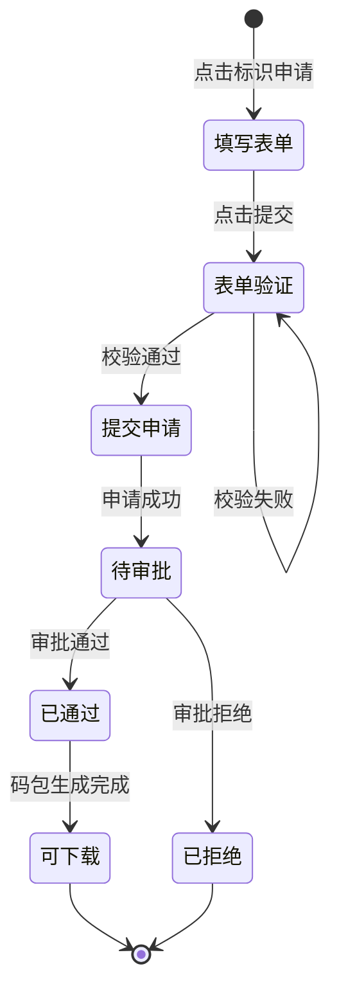
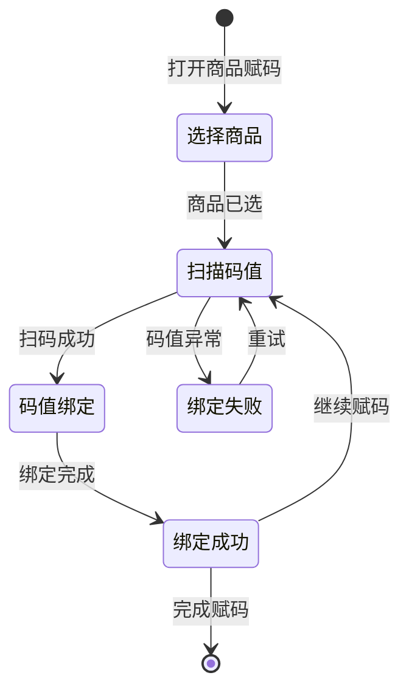
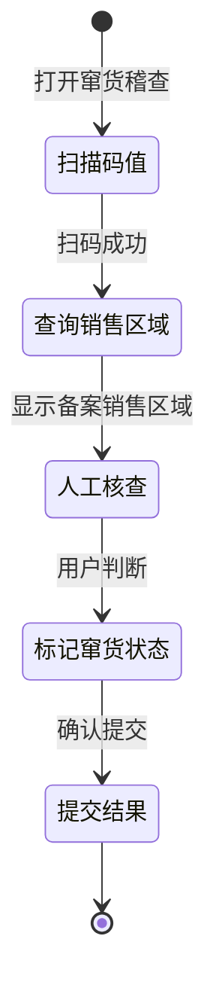

# 微点云平台及微点溯源App产品需求文档

## 文档信息

| 字段 | 值 |
|------|-----|
| 版本 | v1.0 |
| 作者 | 微点科技产品团队 |
| 创建日期 | 2026-03-18 |
| 最后更新 | 2026-05-18 |
| 状态 | 评审中 |
| 所属模块 | 微点云平台 / 微点溯源App（内部发码模式） |

---

## 1. 需求背景

### 1.1 业务目标

- **核心问题**：品牌商需要实现商品全生命周期溯源管理，从赋码到消费者验证的全链路打通，同时支持防窜货稽查和市场抽检
- **目标用户**：品牌制造商、经销商、仓库管理人员、市场稽查人员
- **核心价值**：提供从**内部发码**到**溯源管理**的一站式SaaS平台，降低品牌商接入成本
- **量化指标**：
  - 支持年发码量 < 1 亿的中小规模品牌商
  - 消费者扫码验证成功率 ≥ 99.5%
  - 窜货预警响应时间 < 24小时

### 1.2 目标用户角色

| 角色 | 描述 | 核心诉求 |
|------|------|---------|
| 企业管理员 | 云平台超级管理员 | 开户注册、企业信息维护、权限分配 |
| 品牌运营人员 | 负责发码和溯源配置 | 标识申请、码库管理、溯源模板配置 |
| 仓库操作员 | 执行扫码出入库 | 扫码赋码、打包、入库、出库、转仓 |
| 市场稽查员 | 市场抽检和窜货核查 | 扫码稽查、窜货标记、信息查询 |
| 消费者 | 扫码验证真伪 | 扫码鉴伪、查看溯源信息 |

### 1.3 业务流程概览

| 序号 | 阶段 | 角色 | 操作端 | 关键操作 | 产生的业务数据 |
|------|------|------|--------|---------|--------------|
| 1 | 开户注册 | 企业管理员 | 微点云Web | 注册账号、填写企业信息、上传资质 | 企业账号、企业ID |
| 2 | 标识申请 | 品牌运营人员 | 微点云Web | 申请内部发码标识、上传关联数据 | 码值申请单、授权码包(.wdata) |
| 3 | 码库下载 | 品牌运营人员 | 微点云Web | 下载内部发码码包 | 码包文件、制图数据 |
| 4 | 商品建档 | 品牌运营人员 | 微点云Web | 品牌管理、商品管理、包装单位配置 | 商品主数据 |
| 5 | 溯源配置 | 品牌运营人员 | 微点云Web | 配置溯源模板、绑定模板与标识 | 溯源展示信息 |
| 6 | 商品赋码 | 仓库操作员 | 微点溯源App | 扫码关联码值和商品 | 商品-码值绑定关系 |
| 7 | 扫码激活 | 仓库操作员 | 微点溯源App | 激活码值使其可被消费者识读 | 激活状态 |
| 8 | 打包关联 | 仓库操作员 | 微点溯源App | 多级包装码值层级关联 | 打包层级关系 |
| 9 | 扫码入库 | 仓库操作员 | 微点溯源App | 扫码将商品入到指定库区 | 入库记录 |
| 10 | 扫码出库 | 仓库操作员 | 微点溯源App | 扫码完成商品发货 | 出库记录 |
| 11 | 窜货稽查 | 市场稽查员 | 微点溯源App | 抽检商品、标记窜货状态 | 窜货记录 |
| 12 | 消费者验证 | 消费者 | 微点鉴/微信 | 扫码查询真伪和溯源信息 | 扫码记录 |

---

## 2. 业务规则

### 2.1 发码中心规则

| 规则编号 | 所属模块 | 规则描述 | 优先级 | 备注 |
|---------|---------|---------|--------|------|
| R001 | 发码中心 | 标识申请支持配置交付类型、标识类型、长度及关联码值信息 | P0 | 标识类型：微点码/微点防伪码/微点包装码/自定义码 |
| R002 | 发码中心 | 审批通过的订单，可撤销或禁用，禁用后无法下载文件 | P1 | 降低误下载风险 |
| R003 | 发码中心 | 关联数据行数与订单申请数量不符时，提示错误并提交失败 | P1 | 降低导入关联数据风险 |
| R004 | 发码中心 | 标识概览列表增加【文件名前缀备注】字段，支持按该字段搜索 | P2 | 功能增强 |
| R005 | 发码中心 | 码库管理用于排版软件制图，需配合码包、码库、制图模板使用 | P0 | |
| R006 | 发码中心 | 导出访问链接支持明文链接和密文链接两种方式 | P1 | 加密保护码值 |

### 2.2 商品中心规则

| 规则编号 | 所属模块 | 规则描述 | 优先级 | 备注 |
|---------|---------|---------|--------|------|
| R010 | 商品中心 | 品牌信息需先维护，品牌下挂靠商品 | P0 | |
| R011 | 商品中心 | 商品管理需关联品牌和包装单位 | P0 | |
| R012 | 商品中心 | 包装单位用于定义商品的多级包装层级 | P0 | 如：个/盒/箱/垛 |

### 2.3 溯源中心规则

| 规则编号 | 所属模块 | 规则描述 | 优先级 | 备注 |
|---------|---------|---------|--------|------|
| R020 | 溯源中心 | 溯源模板配置支持文本、图片、视频等多种数据类型 | P0 | |
| R021 | 溯源中心 | 图片类型数据可配置是否允许长按保存 | P1 | |
| R022 | 溯源中心 | 码值与溯源模板绑定后，消费者扫码可查看溯源信息 | P0 | |
| R023 | 溯源中心 | 数据采集支持为单个码值录入单独的溯源信息 | P1 | |

### 2.4 防窜中心规则

| 规则编号 | 所属模块 | 规则描述 | 优先级 | 备注 |
|---------|---------|---------|--------|------|
| R030 | 防窜中心 | 窜货稽查支持人工抽检并标记窜货/未窜货状态 | P0 | |
| R031 | 防窜中心 | 窜货预警可设置经销商销售区域范围 | P0 | |
| R032 | 防窜中心 | 窜货记录完整记录商品流转异常情况 | P0 | |

### 2.5 生产中心规则

| 规则编号 | 所属模块 | 规则描述 | 优先级 | 备注 |
|---------|---------|---------|--------|------|
| R040 | 生产中心 | 打包关系管理用于设置商品的多级包装规则 | P0 | |
| R041 | 生产中心 | 打包关联时需指定批次号和生产日期 | P0 | |
| R042 | 生产中心 | 尾箱关联支持打包即入库选项 | P1 | |
| R043 | 生产中心 | 入库任务可配置默认入库仓库 | P1 | |
| R044 | 生产中心 | 出库任务支持备注功能 | P1 | |

### 2.6 码值管理规则

| 规则编号 | 所属模块 | 规则描述 | 优先级 | 备注 |
|---------|---------|---------|--------|------|
| R050 | 码值管理 | 商品赋码是扫码溯源和扫码打包的必要前置步骤 | P0 | |
| R051 | 码值管理 | 已打包状态的码值不能取消赋码，需先解除打包关系 | P0 | |
| R052 | 码值管理 | 码值激活后消费者才能扫码识读 | P0 | |
| R053 | 码值管理 | 只有未被使用的码值可以作废 | P0 | |
| R054 | 码值管理 | 码值替换后新码值继承旧码值的商品信息、层级关系、入库记录 | P0 | |
| R055 | 码值管理 | 替换操作需新旧码值均非作废状态 | P0 | |

### 2.7 外部标识管理规则

| 规则编号 | 所属模块 | 规则描述 | 优先级 | 备注 |
|---------|---------|---------|--------|------|
| R060 | 外部标识 | 上传药监码文件必须为txt格式，单列数据，首行必须为正式数据 | P0 | |
| R061 | 外部标识 | 外部标识赋码支持预关联微点码选项 | P0 | |
| R062 | 外部标识 | 整体关联集成标识关联和打包关联，适用于药监码场景 | P1 | |

---

## 3. 数据字段定义

### 3.1 企业信息

| 字段名 | 字段类型 | 是否必填 | 校验规则 | 默认值 | 备注 |
|--------|---------|---------|---------|--------|------|
| 企业ID | String | 是 | 系统生成，8位数字 | — | 唯一标识 |
| 企业名称 | String | 是 | 2-50字符 | — | |
| 企业法人 | String | 是 | 2-20字符 | — | |
| 统一社会信用代码 | String | 是 | 18位统一代码格式 | — | |
| 企业地址 | String | 否 | 最多200字符 | — | |
| 营业执照 | File | 是 | jpg/png/pdf，≤5MB | — | 上传资质文件 |

### 3.2 标识申请

| 字段名 | 字段类型 | 是否必填 | 校验规则 | 默认值 | 备注 |
|--------|---------|---------|---------|--------|------|
| 申请单号 | String | 是 | 系统生成 | — | 唯一标识 |
| 制作方 | String | 是 | 最多50字符 | — | |
| 产品系列 | String | 是 | 最多50字符 | — | |
| 标识类型 | Enum | 是 | 微点码/微点防伪码/微点包装码/自定义码 | — | |
| 标识长度 | Int | 是 | 8-16位 | 12 | |
| 申请数量 | Int | 是 | 100-10000000 | — | |
| 收货地址 | String | 是 | 最多200字符 | — | |
| 收货邮箱 | String | 是 | 邮箱格式 | — | 用于接收码包 |
| 文件名前缀备注 | String | 否 | 最多50字符 | — | 便于识别 |
| 关联数据文件 | File | 否 | txt/xlsx，≤10MB | — | 上传关联数据 |

### 3.3 商品信息

| 字段名 | 字段类型 | 是否必填 | 校验规则 | 默认值 | 备注 |
|--------|---------|---------|---------|--------|------|
| 商品ID | String | 是 | 系统生成 | — | 唯一标识 |
| 商品名称 | String | 是 | 2-100字符 | — | |
| 品牌ID | String | 是 | 关联品牌表 | — | |
| 包装单位 | String | 是 | JSON格式多级包装 | — | 如：{"unit":"件","children":[{"unit":"盒"},{"unit":"个"}]} |
| 生产日期 | Date | 否 | yyyy-MM-dd格式 | — | |
| 批次号 | String | 否 | 最多30字符 | — | |

### 3.4 码值信息

| 字段名 | 字段类型 | 是否必填 | 校验规则 | 默认值 | 备注 |
|--------|---------|---------|---------|--------|------|
| 码值 | String | 是 | 微点码格式校验 | — | 唯一标识 |
| 商品ID | String | 是 | 关联商品表 | — | |
| 状态 | Enum | 是 | 未赋码/已赋码/已激活/已打包/已入库/已出库/已作废 | 未赋码 | |
| 批次号 | String | 否 | 最多30字符 | — | |
| 生产日期 | Date | 否 | yyyy-MM-dd格式 | — | |
| 入库时间 | DateTime | 否 | yyyy-MM-dd HH:mm:ss | — | |
| 出库时间 | DateTime | 否 | yyyy-MM-dd HH:mm:ss | — | |
| 上级码值 | String | 否 | 关联上级码值 | — | 用于打包层级 |
| 仓库ID | String | 否 | 关联仓库表 | — | |

### 3.5 打包关系

| 字段名 | 字段类型 | 是否必填 | 校验规则 | 默认值 | 备注 |
|--------|---------|---------|---------|--------|------|
| 打包规则ID | String | 是 | 系统生成 | — | 唯一标识 |
| 规则名称 | String | 是 | 最多50字符 | — | |
| 商品ID | String | 是 | 关联商品表 | — | |
| 包装层级 | JSON | 是 | 层级定义 | — | |
| 批次号 | String | 是 | 最多30字符 | — | |
| 生产日期 | Date | 是 | yyyy-MM-dd格式 | — | |
| 操作人 | String | 是 | 关联用户表 | — | |
| 操作时间 | DateTime | 是 | yyyy-MM-dd HH:mm:ss | — | |

### 3.6 窜货记录

| 字段名 | 字段类型 | 是否必填 | 校验规则 | 默认值 | 备注 |
|--------|---------|---------|---------|--------|------|
| 记录ID | String | 是 | 系统生成 | — | 唯一标识 |
| 码值 | String | 是 | 关联码值表 | — | |
| 稽查地点 | String | 是 | 最多100字符 | — | |
| 稽查时间 | DateTime | 是 | yyyy-MM-dd HH:mm:ss | — | |
| 窜货状态 | Enum | 是 | 窜货/未窜货 | — | |
| 报案人 | String | 否 | 最多20字符 | — | |
| 备注 | String | 否 | 最多200字符 | — | |

---

## 4. 页面交互逻辑

### 4.1 注册/登录页面

**页面类型**：表单页

| 步骤 | 用户操作 | 系统响应 | 备注 |
|------|---------|---------|------|
| 1 | 访问注册页面 | 显示注册表单 | 企业自行开户 |
| 2 | 填写手机号、密码、企业信息 | 表单验证 | 手机号格式、企业名称必填 |
| 3 | 上传营业执照、企业授权书 | 文件上传验证 | jpg/png/pdf格式，不超过5MB |
| 4 | 点击注册 | 提交注册申请 | 系统发送验证码 |
| 5 | 输入验证码 | 验证完成 | |
| 6 | 注册成功 | 跳转到登录页面 | 显示登录账号 |

**状态处理**：
- **加载中**：显示loading加载动画
- **空状态**：N/A（首次注册）
- **错误状态**：显示红色提示文字，如"手机号格式错误"、"企业名称不能为空"

---

### 4.2 标识申请页面

**页面类型**：表单页

| 步骤 | 用户操作 | 系统响应 | 备注 |
|------|---------|---------|------|
| 1 | 点击【标识申请】按钮 | 打开申请表单 | |
| 2 | 选择制作方、产品系列 | 下拉选择 | |
| 3 | 选择标识类型 | 单选：微点码/微点防伪码/微点包装码/自定义码 | |
| 4 | 输入标识长度 | 默认12位 | 8-16位范围校验 |
| 5 | 输入申请数量 | 数字输入 | 100-10000000范围 |
| 6 | 填写收货地址、邮箱 | 必填项 | |
| 7 | 上传关联数据文件（可选） | 文件上传组件 | txt/xlsx格式 |
| 8 | 点击提交 | 发起申请 | |
| 9 | 申请成功 | 显示成功提示，跳转到标识概览 | 订单状态：待审批 |

**状态处理**：
- **加载中**：表单按钮显示loading状态
- **空状态**：N/A
- **错误状态**：显示错误提示，如"关联数据行数与申请数量不符"



**状态-权限映射**：

| 状态 | 可转移状态 | 触发条件 | 权限要求 | 前端展示 |
|------|---------|---------|--------|--------|
| 待审批 | 已通过/已拒绝 | 运营平台审批 | 运营平台管理员 | 状态标签：待审批 |
| 已通过 | 可下载 | 码包生成完成 | 品牌运营人员 | 下载按钮可点击 |
| 已拒绝 | — | 审批拒绝 | 申请人 | 查看拒绝原因 |

---

### 4.3 码值查询页面（微点溯源App）

**页面类型**：查询页

| 步骤 | 用户操作 | 系统响应 | 备注 |
|------|---------|---------|------|
| 1 | 扫描或录入码值 | 扫码识别 | 支持微点码和二维码 |
| 2 | 系统查询码值信息 | 返回查询结果 | 显示商品信息、溯源信息、打包关联信息、出入库记录、操作日志 |
| 3 | 查看详情 | 展开详细信息 | |

**状态处理**：
- **加载中**：显示加载动画
- **空状态**：显示"未查询到该码值信息"
- **错误状态**：显示"网络异常，请重试"

---

### 4.4 商品赋码页面（微点溯源App）

**页面类型**：操作页

| 步骤 | 用户操作 | 系统响应 | 备注 |
|------|---------|---------|------|
| 1 | 选择品牌、商品 | 下拉选择 | 必选 |
| 2 | 扫描码值 | 识别微点码 | 支持批量扫描 |
| 3 | 系统绑定商品与码值 | 显示绑定成功 | |
| 4 | 继续扫描下一码值 | 返回步骤2 | |
| 5 | 点击完成 | 结束赋码 | |

**状态处理**：
- **加载中**：扫码按钮显示loading
- **空状态**：显示"请先选择商品"
- **错误状态**：显示错误原因，如"该码已赋码"



---

### 4.5 打包关联页面（微点溯源App）

**页面类型**：操作页

| 步骤 | 用户操作 | 系统响应 | 备注 |
|------|---------|---------|------|
| 1 | 手动选择商品 | 下拉选择 | |
| 2 | 选择包装规则 | 下拉选择 | 定义好的打包规则 |
| 3 | 选择包装层级 | 下拉选择 | 如：盒/箱/垛 |
| 4 | 输入批次号、生产日期 | 表单输入 | |
| 5 | 开始扫描 | 启动扫码 | |
| 6 | 扫描各级码值 | 逐级关联 | 按层级依次扫描 |
| 7 | 完成打包 | 提交打包关系 | |

**状态处理**：
- **加载中**：显示扫描进度
- **空状态**：显示"请先选择商品和包装规则"
- **错误状态**：显示错误原因，如"码值已打包"

---

### 4.6 窜货稽查页面（微点溯源App）

**页面类型**：操作页

| 步骤 | 用户操作 | 系统响应 | 备注 |
|------|---------|---------|------|
| 1 | 扫描或录入码值 | 识别码值 | |
| 2 | 系统查询商品销售区域信息 | 显示商品备案的销售区域 | |
| 3 | 人工核对实际销售区域 | 用户判断 | |
| 4 | 标记窜货状态 | 选择窜货/未窜货 | |
| 5 | 填写备注（可选） | 备注信息 | |
| 6 | 提交稽查结果 | 保存窜货记录 | |

**状态处理**：
- **加载中**：显示加载动画
- **空状态**：显示"请扫描商品码值"
- **错误状态**：显示"码值不存在"



---

### 4.7 码值替换页面（微点溯源App）

**页面类型**：操作页

| 步骤 | 用户操作 | 系统响应 | 备注 |
|------|---------|---------|------|
| 1 | 输入被替换的码值 | 扫描或手动录入 | |
| 2 | 输入需要替换的码值 | 扫描或手动录入 | |
| 3 | 系统验证码值状态 | 检查码值状态 | |
| 4 | 确认替换 | 执行替换 | |
| 5 | 替换成功 | 显示成功提示 | 新码值继承旧码值信息 |

**状态处理**：
- **加载中**：显示替换进度
- **空状态**：显示"请输入被替换的码值"
- **错误状态**：显示错误原因，如"码值已作废，不可替换"

---

## 5. 异常处理方案

| 编号 | 异常场景 | 触发条件 | 处理方案 | 用户提示 |
|------|---------|---------|---------|---------|
| E001 | 网络异常 | 移动端网络断开或超时 | 自动重试3次，每次间隔2秒 | "网络连接异常，请检查网络后重试" |
| E002 | 权限不足 | 用户无操作权限 | 提示无权限，阻断操作 | "您无此操作权限，请联系管理员" |
| E003 | 数据冲突 | 码值已被其他操作占用 | 提示数据状态并刷新 | "该码值已被其他操作占用，请刷新后重试" |
| E004 | 并发操作 | 同一码值被多人同时操作 | 后提交的请求排队等待 | "操作进行中，请稍后重试" |
| E005 | 数据不存在 | 查询的码值/商品不存在 | 提示查询无结果 | "未查询到相关数据" |
| E006 | 码值状态异常 | 码值处于不可操作状态 | 提示当前状态 | "该码值已作废，不可进行此操作" |
| E007 | 批次号校验失败 | 打包时批次号与码值不匹配 | 提示批次号错误 | "批次号不匹配，请核对后重试" |
| E008 | 仓库不匹配 | 追加打包时仓库信息不一致 | 阻止追加操作 | "仓库信息不一致，不允许追加打包" |
| E009 | 文件格式错误 | 上传的关联数据文件格式不正确 | 提示正确的文件格式 | "文件格式错误，请上传txt格式文件" |
| E010 | 数量不匹配 | 关联数据行数与申请数量不符 | 阻止提交并提示 | "关联数据行数与申请数量不符，请检查后重新上传" |

---

## 6. 验收标准

### Happy Path

```gherkin
Scenario: AC001 - 标识申请流程 (P0)
  Given 企业已注册并登录微点云平台
  And 已选择制作方和产品系列
  When 选择标识类型为"微点码"
  And 输入标识长度为12位
  And 输入申请数量为10000
  And 填写收货地址和邮箱
  And 点击提交申请
  Then 显示申请成功提示 (Frontend)
  And 订单状态变为"待审批" (Backend)
  And 申请记录显示在标识概览列表中 (Frontend)

Scenario: AC002 - 商品赋码扫码流程 (P0)
  Given 仓库操作员已登录微点溯源App
  When 选择品牌和商品
  And 扫描第一个微点码
  Then 显示绑定成功提示 (Frontend)
  And 码值状态变为"已赋码" (Backend)
  And 继续扫描下一码值自动完成绑定 (Frontend)

Scenario: AC003 - 多级打包关联流程 (P0)
  Given 仓库操作员已完成商品赋码
  When 选择商品和包装规则"盒-箱-垛"
  And 选择包装层级为"盒"
  And 输入批次号"Batch20260518"
  And 扫描10个单品码值
  Then 显示打包成功 (Frontend)
  And 10个单品码值的上级码值绑定为同一盒码 (Backend)
  And 盒码状态变为"已打包" (Backend)

Scenario: AC004 - 扫码入库流程 (P0)
  Given 仓库操作员已完成打包关联
  When 选择入库类型"生产入库"
  And 选择仓库"北京仓"和库区"A区"
  And 扫描箱码
  Then 显示入库成功 (Frontend)
  And 箱码入库时间记录当前时间 (Backend)
  And 箱码仓库绑定为"北京仓A区" (Backend)

Scenario: AC005 - 窜货稽查标记流程 (P0)
  Given 市场稽查员已登录微点溯源App
  When 扫描商品码值
  Then 显示商品备案销售区域 (Frontend)
  When 人工核对后标记为"窜货"
  And 填写备注"在非授权区域发现"
  And 点击提交
  Then 显示稽查成功 (Frontend)
  And 窜货记录已保存 (Backend)

Scenario: AC006 - 码值替换流程 (P1)
  Given 商品出现码值绑定错误
  When 输入被替换的码值"A123456"
  And 输入替换码值"B654321"
  Then 显示替换预览信息 (Frontend)
  When 确认替换
  Then 码值B继承码值A的商品信息和入库记录 (Backend)
  And 码值A状态更新 (Backend)
```

### Exception Path

```gherkin
Scenario: AC007 - 码值状态异常拦截 (P0)
  Given 码值A123456状态为"已作废"
  When 用户尝试对码值A123456进行商品赋码
  Then 拦截操作并显示错误 (Frontend)
  And 提示"该码值已作废，不可进行此操作" (Frontend)
  And 后台拒绝操作请求 (Backend)

Scenario: AC008 - 网络异常重试机制 (P1)
  Given 仓库操作员进行扫码入库
  When 网络突然断开
  Then 自动弹出网络异常提示 (Frontend)
  And 显示重试按钮 (Frontend)
  When 用户点击重试
  And 网络恢复
  Then 继续完成入库操作 (Frontend)
  And 入库时间记录实际提交时间 (Backend)

Scenario: AC009 - 仓库信息不一致拦截 (P1)
  Given 单品A已入库到"北京仓A区"
  When 用户尝试追加打包到箱码，箱码仓库为"上海仓"
  Then 拦截追加操作 (Frontend)
  And 提示"仓库信息不一致，不允许追加打包" (Frontend)
  And 后台拒绝操作请求 (Backend)
```

---

## 7. UI 规范约束

| 维度 | 约束 |
|------|------|
| Web端UI组件库 | Vue 3 + Element Plus 2.x |
| 移动端UI组件库 | uni-app + uView UI |
| 品牌主色 | #1890FF（微点蓝） |
| 响应式要求 | Web端响应式布局，移动端适配iOS和Android |
| 图标库 | Element Plus Icons / uView Icons |

---

## 8. 技术约束

| 维度 | 约束 |
|------|------|
| 后端技术栈 | Java 17 + Spring Boot 3.x + MyBatis-Plus |
| 前端技术栈 | Vue 3 + Vite + Element Plus |
| 移动端技术栈 | uni-app + Vue 3 |
| 数据库 | MySQL 8.0 |
| 缓存 | Redis 6.x |
| 消息队列 | RabbitMQ |
| 对象存储 | 阿里云OSS |
| 对接系统 | 微点运营平台、微点制图软件、PDA设备 |
| 参考规范 | 微点码技术对接规范 v2.0 |

---

## 11. 待确认事项

| 编号 | 问题描述 | 提出人 | 提出日期 | 状态 | 结论 |
|------|---------|--------|---------|------|------|
| Q001 | 标识申请数量上限是否可配置？ | 产品团队 | 2026-05-18 | 待讨论 | — |
| Q002 | 打包规则是否支持自定义层级数量限制？ | 产品团队 | 2026-05-18 | 待讨论 | — |
| Q003 | 码值替换操作是否需要审批流程？ | 产品团队 | 2026-05-18 | 待讨论 | — |
| Q004 | 窜货稽查结果是否需要同步通知品牌商？ | 产品团队 | 2026-05-18 | 待讨论 | — |
| Q005 | 微点鉴小程序与微点溯源App的扫码能力是否统一？ | 产品团队 | 2026-05-18 | 待讨论 | — |
